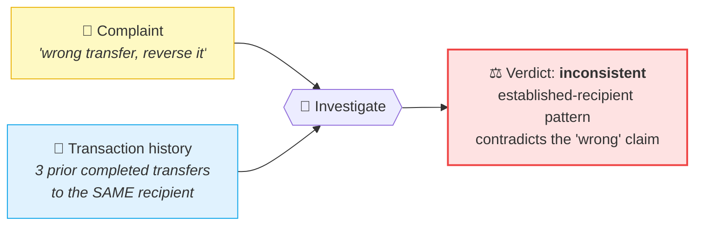
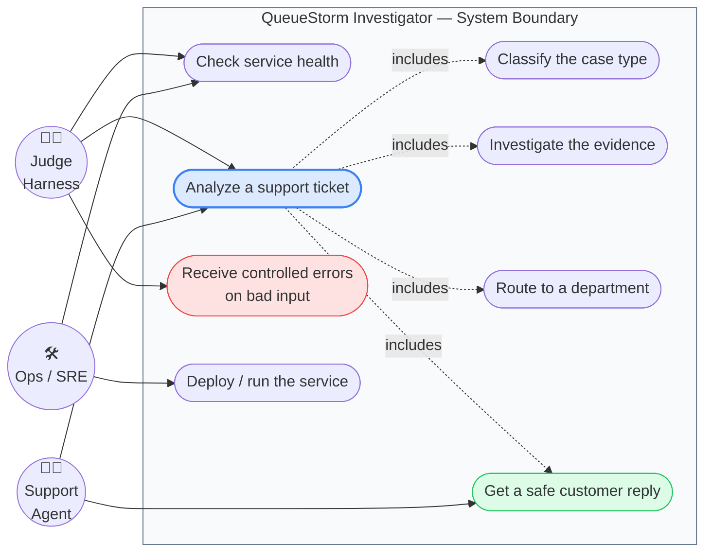
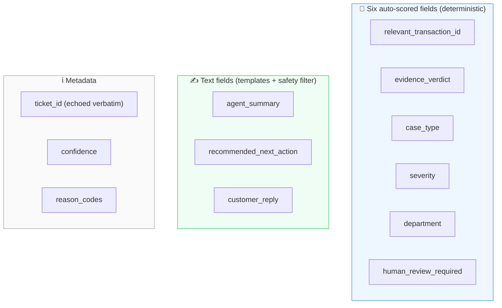

# 01 · 🎯 Overview & Mission

[🏠 Docs Home](../README.md) · **Overview** · [Next ▶ Architecture](../02-architecture/README.md)

---

## The mission

Fintech support teams drown in tickets. A customer writes *"I sent 5000 taka to the wrong number,
please reverse it!"* — but is it really a wrong transfer? Maybe they've sent money to that exact
number three times before. Maybe the transaction never happened. Maybe it's a scammer fishing for an
OTP. **A human agent has to read the complaint, cross-check the transaction history, classify the
case, route it, and write a safe reply — without ever promising a refund they can't authorize or
asking for a PIN.**

The **QueueStorm Investigator** automates that judgement into **one API call**. It is an internal
**copilot for support agents**: read one complaint + a snippet of recent transactions, return one
structured JSON verdict.

> **Org guidance (verbatim):** *"A simple, reliable, safe API will score higher than a complex but
> unreliable one."* — and this design takes that literally.

---

## 🌀 The "Investigator Twist" — the core differentiator

This is **not a complaint classifier — it is a complaint investigator.**

Every input carries **both** the complaint **and** a short snippet of recent transactions (typically
2–5). **The complaint says one thing; the transaction data may say another. The service decides what
is true.**

Two response fields capture this investigation:

| Field | Meaning |
|-------|---------|
| `relevant_transaction_id` | The transaction the complaint refers to — a real id from history, or `null` |
| `evidence_verdict` | `consistent` · `inconsistent` · `insufficient_data` |

> **When the evidence is genuinely unclear, the service SAYS SO — it does not guess.**
> `null` + `insufficient_data` + ask-for-clarification is the **correct, graded** answer for
> vague/ambiguous cases. A service that confidently "confirms" a refund without checking the data
> makes the exact mistake real fintech support must never make.

---

## 🎭 Use-case diagram — who uses the system

| Actor | Goal | Primary use cases |
|-------|------|-------------------|
| **Judge Harness** | Automatically score the API | Health check, analyze tickets, probe malformed input |
| **Support Agent** | Resolve a customer ticket fast | Analyze ticket → get verdict, summary, and a ready-to-send safe reply |
| **Ops / SRE** | Keep the service reachable | Health monitoring, deployment, scaling |

---

## 📦 What the service returns (the verdict)

A single JSON object. The **six auto-scored fields** are decided by deterministic rules; the three
text fields are drafted from safe templates and pass a safety filter.

See the full field-by-field contract in **[Chapter 03 — API Contract](../03-api-contract/README.md)**.

---

## 🧠 Eight case types, four severities, six departments

The complaint is classified into exactly one of **8 case types** (see
[Ch. 06](../06-classification/README.md)):

`wrong_transfer` · `payment_failed` · `refund_request` · `duplicate_payment` ·
`merchant_settlement_delay` · `agent_cash_in_issue` · `phishing_or_social_engineering` · `other`

…then routed to one of **6 departments** with one of **4 severities**. The full enum reference lives
in [Ch. 03](../03-api-contract/README.md#-enum-quick-reference).

---

## 🌍 Multilingual by design

Complaints arrive in **English, Bangla, or mixed "Banglish"**. The classifier carries three keyword
layers (English regex, romanized Banglish, Bangla-script) per case type, and **every customer reply
mirrors the complaint's language**. A Bangla complaint gets a Bangla reply with a Bangla credential
reminder. → [Ch. 10](../10-text-generation/README.md).

---

## ⚖️ Design principles (the non-negotiables)

1. **Rules are the source of truth.** All six scored fields + the safety filter are deterministic.
2. **Safety is a code-level gate, never a model's promise.** Every reply passes the filter last.
3. **Honest uncertainty.** Ambiguous/vague → `null` + `insufficient_data`, not a confident guess.
4. **Never crash.** Malformed input → controlled 400/422/500, the process stays alive.
5. **Exact enums.** A single `StrEnum` source of truth makes an invalid enum impossible to emit.
6. **$0 and offline.** No cloud LLM in the judged path; no quota, cost, or availability risk.

These principles are traced to code throughout the rest of the docs.

---

[🏠 Docs Home](../README.md) · [Next ▶ Architecture](../02-architecture/README.md)
