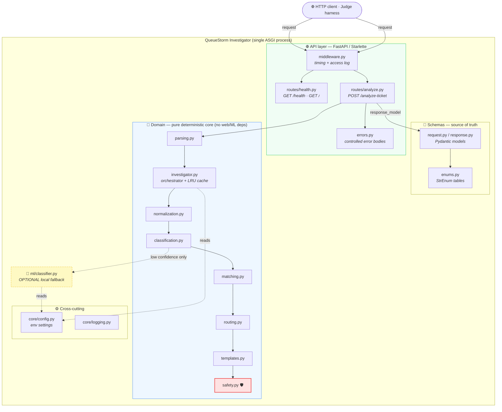
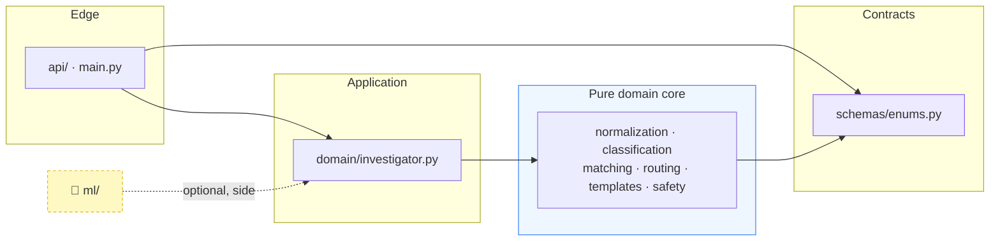
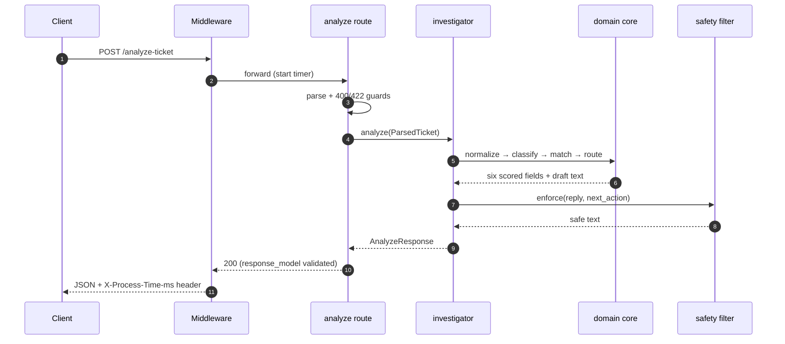

# 02 · 🧱 System Architecture

[◀ Overview](../01-overview/README.md) · [🏠 Docs Home](../README.md) · [Next ▶ API Contract](../03-api-contract/README.md)

---

## Architectural thesis

> A **rules-first hybrid**. A thin async HTTP shell wraps a **pure, deterministic domain core**.
> Web concerns (parsing, status codes, middleware) live at the edge; business logic
> (`domain/`) has **zero web and zero ML dependencies**, so it is fast, reproducible, and
> independently unit-testable. The optional ML classifier and any future LLM sit at the side as
> *assistants that can never decide a scored field.*

---

## 🔭 Container / layered view



---

## 📁 The `src/` layout (as built)

```text
src/queuestorm/
├── main.py                # app factory — wires routers, middleware, startup
├── api/                   # 🌐 HTTP edge
│   ├── routes/health.py   #   GET /health (static, dependency-free) + GET /
│   ├── routes/analyze.py  #   POST /analyze-ticket — tolerant parse, 400/422/500
│   ├── errors.py          #   controlled, non-sensitive error bodies (orjson)
│   └── middleware.py      #   per-request timing header + access logging
├── core/                  # ⚙️ config (env settings) · logging
├── schemas/               # 📐 enums (SOURCE OF TRUTH) · request · response
├── domain/                # 🧠 PURE business logic (zero web/ML deps)
│   ├── normalization.py   #   amounts / language / counterparty (EN·BN·Banglish)
│   ├── classification.py  #   case_type rules + tie-break order
│   ├── matching.py        #   relevant_transaction_id + evidence_verdict
│   ├── routing.py         #   department + severity + human_review
│   ├── templates.py       #   multilingual safe-by-construction replies
│   ├── safety.py          #   🛡️ deterministic OUTPUT SAFETY FILTER (runs last)
│   ├── parsing.py         #   tolerant request → ParsedTicket
│   └── investigator.py    #   pipeline orchestrator + content-keyed LRU cache
└── ml/                    # 🤖 OPTIONAL local fallback classifier + artifacts/*.joblib
```

> `domain/` and `domain/safety.py` have **zero web/ML dependencies** → independently unit-testable
> and covered before deployment. **71 tests pass · 10/10 samples match · ~2,800 req/s, p95 ≈ 20 ms.**

---

## 🧅 The dependency rule (clean architecture)

Dependencies point **inward**. The pure domain core never imports the web framework; the web layer
depends on the domain, not the other way around.



**Why it matters for scoring:** because the core is decoupled from FastAPI and from any model, the
**71 unit tests** exercise the exact logic the judge scores — no HTTP, no network, no flakiness.

---

## 🧰 Tech stack & why each choice wins points

| Layer | Choice | Why it wins points |
|-------|--------|--------------------|
| Language | **Python 3.11+** | Fastest path for a 2-person team; trivial container support |
| Framework | **FastAPI + Starlette** | Async, tiny, batteries-included validation |
| Server | **uvicorn** (dev) · **gunicorn + UvicornWorker** (prod) | Boots in <1s → `/health` green inside 60s; multi-worker throughput |
| Validation | **Pydantic v2 + `StrEnum`** | **Free schema points** — emitting an invalid enum becomes impossible |
| Serialization | **orjson** | Fast parse/dump; used directly for tolerant body parsing & error bodies |
| Optional ML | **scikit-learn + joblib** (~82 KB) | Local, offline, sub-ms robustness hedge — never the source of truth |
| Tooling | **pytest · ruff · mypy · GitHub Actions** | Enforces the contract; fails the build on enum typos |

→ Config is sourced **only** from environment variables with safe defaults
([`core/config.py`](../../src/queuestorm/core/config.py)); see
[Ch. 12 — Deployment](../12-deployment/README.md) for the full table.

---

## 🔀 Request lifecycle at a glance



This sequence is expanded stage-by-stage in
**[Chapter 04 — Investigation Pipeline](../04-investigation-pipeline/README.md)**.

---

## Key architectural decisions (and their rationale)

| Decision | Rationale |
|----------|-----------|
| **Rules decide, models assist** | The judge auto-scores 6 fields + safety; determinism = reproducible full credit and no quota risk |
| **Tolerant parse, strict emit** | Never crash on bad input, but make an invalid output impossible (`response_model`) |
| **Safety filter runs last, always** | Even a jailbroken model cannot put an unsafe string on the wire |
| **Content-keyed LRU cache** | Retried/identical tickets are served from memory; `ticket_id` still echoes per-request |
| **Static `/health`** | No model load / DB / network → ready well within the 60 s window on cold start |
| **`src/` package layout** | Industry-grade, installable, importable in tests without `PYTHONPATH` hacks |

---

[◀ Overview](../01-overview/README.md) · [🏠 Docs Home](../README.md) · [Next ▶ API Contract](../03-api-contract/README.md)
