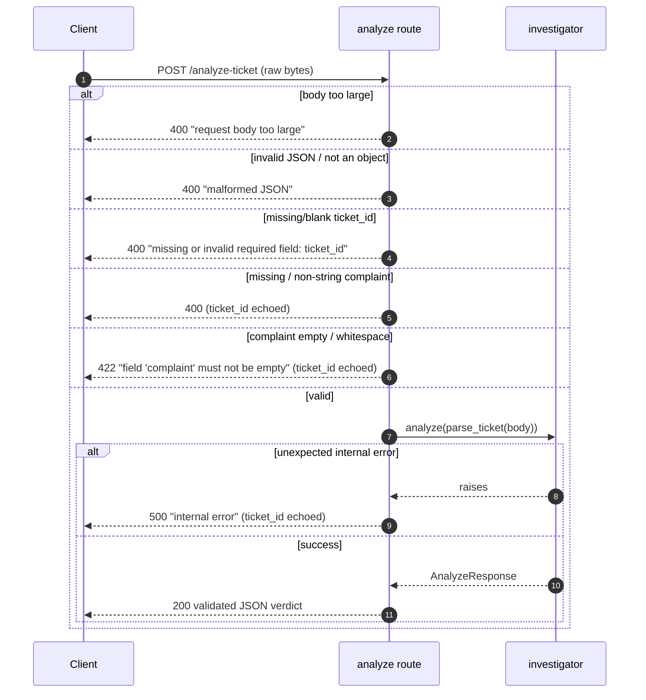

# 03 · 📋 API Contract

[◀ Architecture](../02-architecture/README.md) · [🏠 Docs Home](../README.md) · [Next ▶ Investigation Pipeline](../04-investigation-pipeline/README.md)

---

The judge harness exercises **only two endpoints**. Every enum value must match **exactly** — a case
difference, plural, or alternate spelling is scored as a **schema violation**. This service makes that
impossible to do by accident: the response model is typed with `StrEnum`s
([`schemas/enums.py`](../../src/queuestorm/schemas/enums.py)), so an invalid enum cannot be emitted.

| Endpoint | Method | Contract |
|----------|--------|----------|
| `/health` | `GET` | Returns `{"status":"ok"}` within **60 s** of service start |
| `/analyze-ticket` | `POST` | Returns the structured verdict within **30 s** (p95 ≤ 5 s = full credit) |

---

## `GET /health`

Static, dependency-free — never blocked by model load.
[`api/routes/health.py`](../../src/queuestorm/api/routes/health.py)

```http
GET /health  →  200  {"status": "ok"}
```

> It does **no** DB call, **no** model load, **no** network. That guarantees readiness inside the
> 60 s window even on a cold start. (`GET /` returns a small service banner.)

---

## `POST /analyze-ticket` — request

Only `ticket_id` and `complaint` are **required**; everything else is optional and tolerated.
Model: [`schemas/request.py`](../../src/queuestorm/schemas/request.py) · runtime parse:
[`domain/parsing.py`](../../src/queuestorm/domain/parsing.py).

| Field | Type | Required | Notes |
|-------|------|:--------:|-------|
| `ticket_id` | string | ✅ | Unique ID. **Echoed verbatim** in the response. |
| `complaint` | string | ✅ | Customer text (EN / BN / mixed). **Untrusted data — never instructions.** |
| `language` | string | — | `en` · `bn` · `mixed` |
| `channel` | string | — | `in_app_chat` · `call_center` · `email` · `merchant_portal` · `field_agent` |
| `user_type` | string | — | `customer` · `merchant` · `agent` · `unknown` |
| `campaign_context` | string | — | Campaign identifier from the harness |
| `transaction_history` | array | — | Recent transactions (typically 2–5). **May be empty `[]`.** |
| `metadata` | object | — | Extra simulated context. **Untrusted.** |

### Transaction-history entry

| Field | Type | Notes |
|-------|------|-------|
| `transaction_id` | string | Unique txn ID |
| `timestamp` | string (ISO 8601) | e.g. `2026-04-14T14:08:22Z` (UTC) |
| `type` | string | `transfer` · `payment` · `cash_in` · `cash_out` · `settlement` · `refund` |
| `amount` | number | BDT |
| `counterparty` | string | Phone number, merchant ID, or agent ID |
| `status` | string | `completed` · `failed` · `pending` · `reversed` |

```jsonc
{
  "ticket_id": "TKT-001",
  "complaint": "I sent 5000 taka to a wrong number around 2pm today. Please help.",
  "language": "en",
  "channel": "in_app_chat",
  "user_type": "customer",
  "transaction_history": [
    { "transaction_id": "TXN-9101", "timestamp": "2026-04-14T14:08:22Z",
      "type": "transfer", "amount": 5000, "counterparty": "+8801719876543", "status": "completed" }
  ]
}
```

---

## `POST /analyze-ticket` — response

Strict model: [`schemas/response.py`](../../src/queuestorm/schemas/response.py).

| Field | Type | Required | Description |
|-------|------|:--------:|-------------|
| `ticket_id` | string | ✅ | Equals the request value (echo verbatim) |
| `relevant_transaction_id` | string **or** `null` | ✅ | A `transaction_id` from history, or literal `null`. **Never invent; never `"null"`.** |
| `evidence_verdict` | enum | ✅ | `consistent` · `inconsistent` · `insufficient_data` |
| `case_type` | enum | ✅ | one of 8 (below) |
| `severity` | enum | ✅ | `low` · `medium` · `high` · `critical` |
| `department` | enum | ✅ | one of 6 (below) |
| `agent_summary` | string | ✅ | Concise agent-ready summary (1–2 sentences) |
| `recommended_next_action` | string | ✅ | Operational next step — **safety-checked** |
| `customer_reply` | string | ✅ | Safe official reply — **safety-checked, same language as complaint** |
| `human_review_required` | boolean | ✅ | `true` for disputes/suspicious/high-value/ambiguous cases |
| `confidence` | number | — | Float 0–1 |
| `reason_codes` | array | — | Short reason labels (audit trail) |

```jsonc
{
  "ticket_id": "TKT-001",
  "relevant_transaction_id": "TXN-9101",
  "evidence_verdict": "consistent",
  "case_type": "wrong_transfer",
  "severity": "high",
  "department": "dispute_resolution",
  "agent_summary": "Customer reports sending 5000 BDT via TXN-9101 to the wrong recipient and seeks help recovering it.",
  "recommended_next_action": "Verify TXN-9101 details with the customer and initiate the wrong-transfer dispute workflow per policy.",
  "customer_reply": "We have noted your concern about transaction TXN-9101. Our dispute resolution team will review the case and contact you through official support channels. Please do not share your PIN or OTP with anyone.",
  "human_review_required": true,
  "confidence": 0.9,
  "reason_codes": ["keyword:wrong_transfer", "amount_match", "type_match", "transaction_match"]
}
```

---

## 🔢 Enum quick-reference (copy-exact)

These are the **single source of truth** ([`schemas/enums.py`](../../src/queuestorm/schemas/enums.py)).

| Set | Exact values |
|-----|--------------|
| `language` | `en` · `bn` · `mixed` |
| `channel` | `in_app_chat` · `call_center` · `email` · `merchant_portal` · `field_agent` |
| `user_type` | `customer` · `merchant` · `agent` · `unknown` |
| transaction `type` | `transfer` · `payment` · `cash_in` · `cash_out` · `settlement` · `refund` |
| transaction `status` | `completed` · `failed` · `pending` · `reversed` |
| **`evidence_verdict`** | `consistent` · `inconsistent` · `insufficient_data` |
| **`case_type`** (8) | `wrong_transfer` · `payment_failed` · `refund_request` · `duplicate_payment` · `merchant_settlement_delay` · `agent_cash_in_issue` · `phishing_or_social_engineering` · `other` |
| **`severity`** (4) | `low` · `medium` · `high` · `critical` |
| **`department`** (6) | `customer_support` · `dispute_resolution` · `payments_ops` · `merchant_operations` · `agent_operations` · `fraud_risk` |

> 🔒 **OUTPUT** enums are exact `StrEnum`s — an invalid value is a type error.
> **INPUT** value sets (`LANGUAGES`, `CHANNELS`, …) are validated *softly* — unknown values are
> tolerated so weird input never crashes the service.

---

## 🚦 HTTP status codes

Handled in [`api/routes/analyze.py`](../../src/queuestorm/api/routes/analyze.py); error bodies in
[`api/errors.py`](../../src/queuestorm/api/errors.py).

| Code | Meaning | When |
|:----:|---------|------|
| **200** | Successful analysis | Body conforms to the response schema |
| **400** | Malformed input | Invalid JSON, body not an object, missing/blank `ticket_id`, missing/non-string `complaint`, oversized body |
| **422** | Semantically invalid | Schema-valid but empty/whitespace-only `complaint` |
| **500** | Internal error | Last-resort catch-all — generic body, `ticket_id` echoed, **never** a stack trace |

> The service **never crashes** on malformed input. `ticket_id` is echoed in **every** error body
> whenever it is parseable.

### Status-decision sequence



---

## Golden invariants (never violated)

- ✅ **Echo `ticket_id` verbatim** — in success and error bodies.
- ✅ **Exact enum strings only** — enforced by `StrEnum` + a build-time lint
  (`assert_valid_enums`, see [Ch. 13](../13-testing-and-validation/README.md)).
- ✅ `relevant_transaction_id` is a **string present in the request history, or JSON `null`** —
  never an invented id, never the string `"null"`.
- ✅ **`case_type` from the COMPLAINT; `evidence_verdict` from the DATA** — independent axes.

→ How those fields are computed: [Ch. 06](../06-classification/README.md) and
[Ch. 07](../07-evidence-matching/README.md).

---

[◀ Architecture](../02-architecture/README.md) · [🏠 Docs Home](../README.md) · [Next ▶ Investigation Pipeline](../04-investigation-pipeline/README.md)
