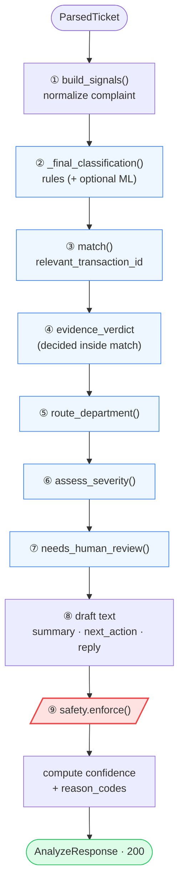
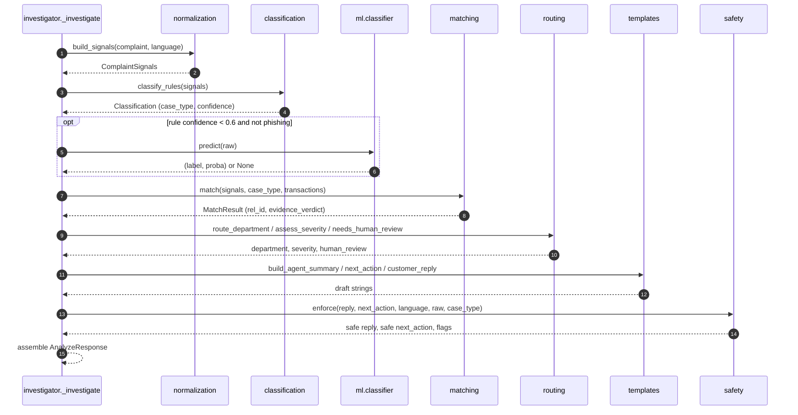
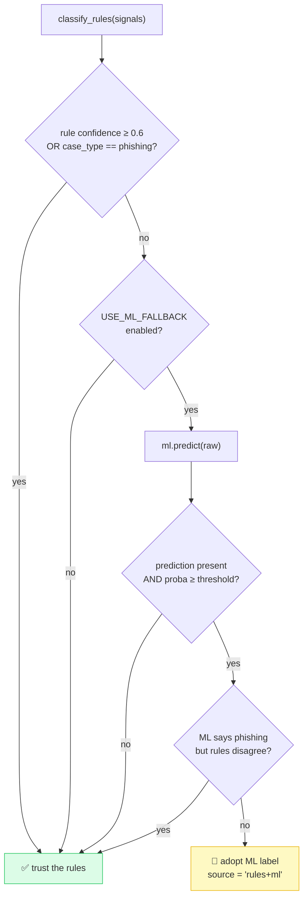
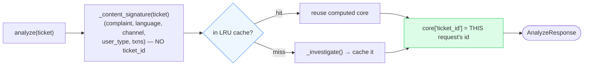

# 04 · 🔬 The Investigation Pipeline

[◀ API Contract](../03-api-contract/README.md) · [🏠 Docs Home](../README.md) · [Next ▶ Normalization](../05-normalization/README.md)

---

The pipeline is the **orchestrator** that turns a parsed ticket into a verdict. It is implemented as
a deterministic state machine in
[`domain/investigator.py`](../../src/queuestorm/domain/investigator.py) and runs the stages in this
**exact order**:

```text
parse → classify case_type → match transaction → judge evidence_verdict
      → route department → set severity → set human_review_required
      → draft text → enforce safety
```

> **Why order matters:** `case_type` is classified *before* matching so that phishing/safety cases
> short-circuit (they often have empty history). The safety filter runs *last* so nothing unsafe can
> escape — regardless of who wrote the text.

---

## 🏃 Activity diagram — end-to-end flow



The blue stages produce the **six auto-scored fields**; the red stage is the **independent safety
guarantee**.

---

## 🔁 Sequence diagram — module collaboration



---

## Stage-by-stage reference

| # | Stage | Function | Chapter |
|:-:|-------|----------|---------|
| ① | Normalize | `build_signals()` | [05 · Normalization](../05-normalization/README.md) |
| ② | Classify case_type | `_final_classification()` → `classify_rules()` (+ ML) | [06 · Classification](../06-classification/README.md) |
| ③ | Match transaction | `match()` → `relevant_transaction_id` | [07 · Evidence Matching](../07-evidence-matching/README.md) |
| ④ | Judge verdict | inside `match()` → `evidence_verdict` | [07 · Evidence Matching](../07-evidence-matching/README.md) |
| ⑤ | Route department | `route_department()` | [08 · Routing & Severity](../08-routing-and-severity/README.md) |
| ⑥ | Set severity | `assess_severity()` | [08 · Routing & Severity](../08-routing-and-severity/README.md) |
| ⑦ | Human review | `needs_human_review()` | [08 · Routing & Severity](../08-routing-and-severity/README.md) |
| ⑧ | Draft text | `build_*` in `templates.py` | [10 · Text Generation](../10-text-generation/README.md) |
| ⑨ | Enforce safety | `safety.enforce()` | [09 · Safety System](../09-safety-system/README.md) |

---

## 🤖 How the ML fallback is gated (stage ②)

The rule classifier is trusted outright when it is confident. The optional local model is consulted
**only** in a narrow window — and can never escalate to fraud on weak signal.



Implemented in `_final_classification()`. The `_ML_ELIGIBLE_FLOOR = 0.6` constant is the confidence
bar; see [Ch. 06](../06-classification/README.md) for details.

---

## 🗃️ Content-keyed LRU cache

Heavy work is cached so retried/identical tickets are served from memory — but the **echoed
`ticket_id` always reflects the current request**.



- **Signature excludes `ticket_id`** → two requests with the same content but different ticket IDs
  share the cached computation, and each still echoes its own `ticket_id`.
- Cache size is `CACHE_SIZE` (default **2048**), configurable via env.
- See [Ch. 11 — Reliability & Performance](../11-reliability-and-performance/README.md).

---

## 📊 Confidence & reason codes

After the fields are decided, `investigator` assembles two metadata fields:

- **`confidence`** = `min(classification.confidence, 0.97)`, further capped at **0.65** when the
  verdict is `insufficient_data` (honest uncertainty is reflected numerically).
- **`reason_codes`** = de-duplicated union of classification + matching reasons, plus
  `safety_filtered` if the safety filter changed anything. This is the **audit trail** for why the
  service decided what it did.

---

[◀ API Contract](../03-api-contract/README.md) · [🏠 Docs Home](../README.md) · [Next ▶ Normalization](../05-normalization/README.md)
