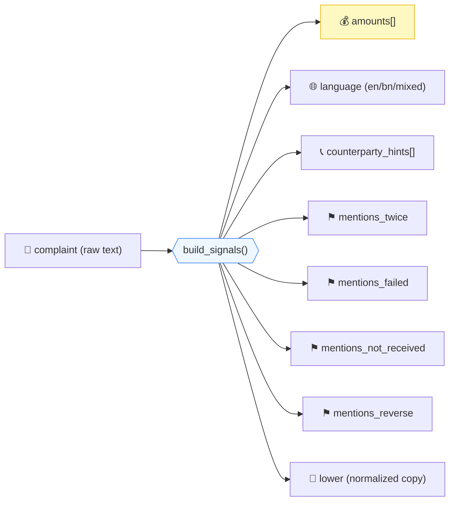
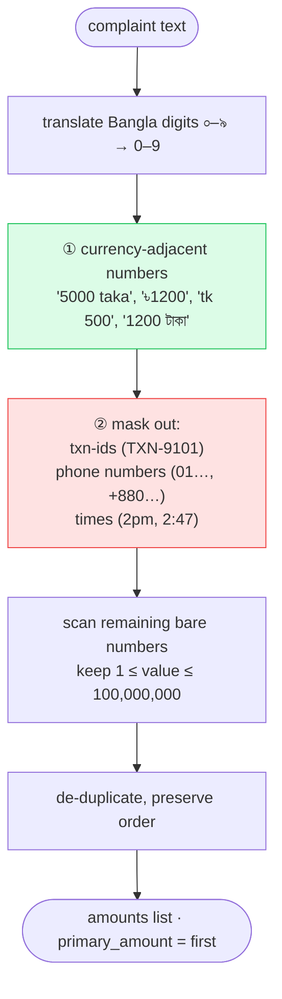
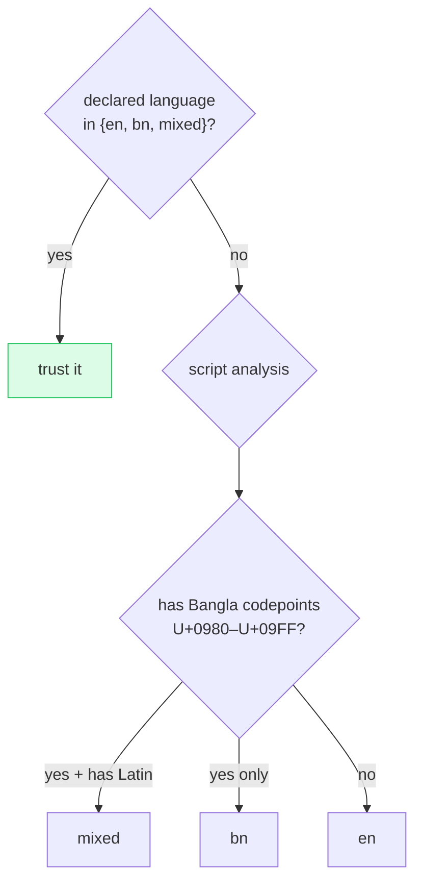

# 05 · 🧹 Normalization & Signal Extraction

[◀ Investigation Pipeline](../04-investigation-pipeline/README.md) · [🏠 Docs Home](../README.md) · [Next ▶ Classification](../06-classification/README.md)

---

**Stage ①** of the pipeline. Free-form complaint text (English / Bangla / Banglish) is turned into a
structured `ComplaintSignals` object the rest of the engine reasons over. Pure functions, no I/O,
fast and unit-testable.

📄 Source: [`domain/normalization.py`](../../src/queuestorm/domain/normalization.py) ·
🧪 Tests: [`tests/unit/test_normalization.py`](../../tests/unit/test_normalization.py)

---

## What it extracts

The `ComplaintSignals` dataclass also exposes `primary_amount` (the first extracted amount), used as
the strongest matching signal downstream.

---

## 🏃 Amount extraction — activity flow

Amounts are the **single strongest** transaction-matching signal, so extraction must be careful:
a phone number, a time, or a transaction id must **never** be read as an amount.

**Example:** `"I sent 5000 taka to 01712345678 around 2pm today"` →

| Token | Decision |
|-------|----------|
| `5000` (next to "taka") | ✅ amount = `5000` |
| `01712345678` | ❌ masked — phone number |
| `2pm` | ❌ masked — time |

So `primary_amount = 5000.0`. This exact case is covered by
`test_amount_ignores_phone_and_time`.

---

## 🌐 Language detection

A **valid declared `language`** is trusted first; otherwise the language is detected from the script.
This drives reply-language selection in [Ch. 10](../10-text-generation/README.md).

---

## 📞 Counterparty hints

Phone numbers and `AGENT-`/`MERCHANT-`/`BILLER-` IDs mentioned in the complaint are extracted (Bangla
digits normalized first). A hint that matches a transaction's `counterparty` is a **decisive**
matching signal — and crucially, its **absence** is what makes SAMPLE-08 ambiguous (→ `null`). See
[Ch. 07](../07-evidence-matching/README.md).

---

## ⚑ Boolean cue flags (EN · BN · Banglish)

Each flag is set by a multilingual pattern so the same intent is caught across languages:

| Flag | Fires on (examples) | Used by |
|------|---------------------|---------|
| `mentions_twice` | "twice", "double", "again", `dui bar`, `দুইবার`, `ডবল` | duplicate detection |
| `mentions_failed` | "failed", "declined", `fail holo`, `ফেইল`, `ব্যর্থ`, `হয়নি` | payment-failed matching |
| `mentions_not_received` | "not received/credited", `pai ni`, `আসেনি`, `পাইনি` | pending-status corroboration |
| `mentions_reverse` | "reverse", "refund", "return", `ferot`, `ফেরত`, `রিফান্ড` | refund/wrong-transfer cues |

> These flags feed both classification and the transaction matcher — e.g. `mentions_not_received`
> + a `pending` transaction corroborates an agent-cash-in or settlement complaint.

---

## Why pure functions matter here

`normalization.py` imports **nothing** from the web or ML layers. That means:

- It runs in **microseconds** (regex over a short string).
- It is **deterministic** — same input, same signals, every time.
- It is **directly unit-tested** without spinning up HTTP — see the 7 tests in
  [`test_normalization.py`](../../tests/unit/test_normalization.py).

---

[◀ Investigation Pipeline](../04-investigation-pipeline/README.md) · [🏠 Docs Home](../README.md) · [Next ▶ Classification](../06-classification/README.md)
