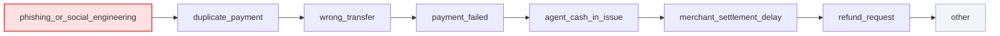
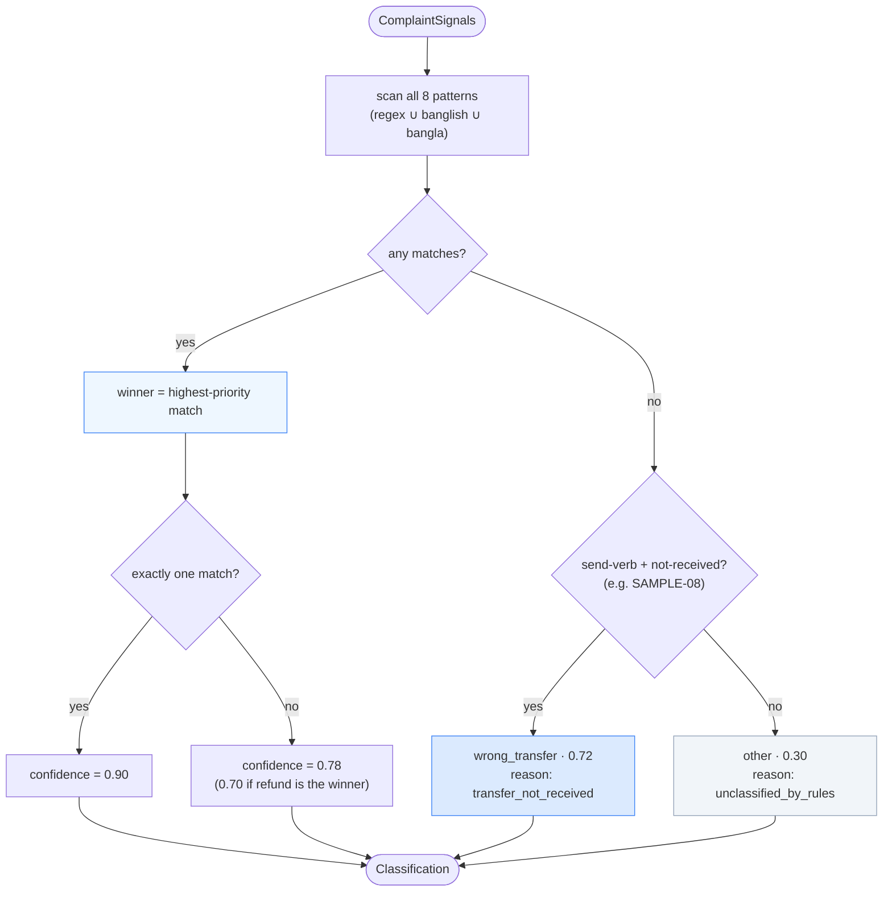
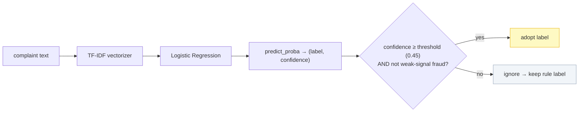

# 06 · 🏷️ Case-Type Classification

[◀ Normalization](../05-normalization/README.md) · [🏠 Docs Home](../README.md) · [Next ▶ Evidence Matching](../07-evidence-matching/README.md)

---

**Stage ②.** Classify the complaint into exactly one of **8 `case_type`s** — from the **complaint text
only** (the `evidence_verdict` is a *separate* axis decided later from the data).

📄 Source: [`domain/classification.py`](../../src/queuestorm/domain/classification.py) ·
🤖 ML hedge: [`ml/classifier.py`](../../src/queuestorm/ml/classifier.py) ·
🧪 Tests: [`tests/unit/test_classification.py`](../../tests/unit/test_classification.py)

> **Golden rule:** a `null` transaction must **not** force `case_type = other`. SAMPLE-08 stays
> `wrong_transfer` with `relevant_transaction_id = null`. Classification and matching are independent.

---

## The 8 case types & their triggers

Each case type carries **three keyword layers** so EN, Bangla-script, and romanized "Banglish"
complaints all classify:

- **`regex`** — English (+ shared) patterns, matched on a lowercased copy
- **`banglish`** — romanized Bangla (`vul`/`bhul`, `fail holo`, `dui bar`, `ferot`, …)
- **`bangla`** — Bangla-script substrings, matched on the raw text

| `case_type` | EN triggers | Bangla / Banglish cues |
|-------------|-------------|------------------------|
| `phishing_or_social_engineering` | otp, pin, password, "share your code", "account will be blocked", scam, "claiming to be from us", link/click | ওটিপি, পিন, পাসওয়ার্ড, "থেকে বলছি", "ব্লক হবে", প্রতারক, লিংক |
| `duplicate_payment` | twice, two times, double, "charged again", "deducted twice" | দুইবার, ডবল, `dui bar`, "একবার দিছি কিন্তু" |
| `wrong_transfer` | "wrong number/person", "sent to the wrong", "typed it wrong", "by mistake" | ভুল নম্বরে, ভুল লোকে, `vul/bhul`, ভুল করে পাঠ |
| `payment_failed` | "failed but deducted", "showed failed", recharge/bill **failed** | ফেইল হয়েছে কিন্তু, ব্যর্থ, `fail holo but taka kete nilo` |
| `agent_cash_in_issue` | "cash in", "deposited through agent", "not in my balance" | ক্যাশ ইন, এজেন্ট, ব্যালেন্সে আসেনি |
| `merchant_settlement_delay` | merchant settlement, "not settled", payout, "my sales" | সেটেলমেন্ট, বিক্রির টাকা, পেআউট |
| `refund_request` | refund, "want my money back", "changed my mind", return | রিফান্ড, টাকা ফেরত চাই, মন বদল |
| `other` | anything unmatched / vague | unclassifiable |

---

## 🥇 Tie-break order (safety first)

When several patterns match, the **highest-priority** case type wins. Order
(`PRIORITY` in code):



- **Phishing wins even if a txn amount is mentioned** — a credential-harvesting message can never be
  mislabelled.
- `duplicate_payment` beats generic `payment_failed`/`refund` ("deducted twice" is specific).
- `wrong_transfer` beats `refund_request` when "reverse"/"wrong" + a send — but a pure
  **change-of-mind on a real purchase** is `refund_request` (SAMPLE-04).

> **Refund vs wrong-transfer:** "Please refund / reverse it" alone does **not** make it a refund —
> look at the **cause**. Wrong recipient ⇒ `wrong_transfer`. Failed-with-deduction ⇒
> `payment_failed`. Duplicate ⇒ `duplicate_payment`. Merchant change-of-mind ⇒ `refund_request`.

---

## 🏃 Classification activity flow



### The "transfer not received" inference

If **no** keyword pattern matches but the complaint contains a **money-send verb** (`sent`, `send`,
`transfer`, পাঠ, `pathai…`) **and** `mentions_not_received`, the complaint is inferred as a
`wrong_transfer` dispute (confidence 0.72). This is how SAMPLE-08 ("I sent money to X but it wasn't
received") classifies correctly even without an explicit "wrong" keyword — only when no stronger case
matched.

---

## 🤖 Optional ML fallback (the hedge)

When rule confidence is **low** (`< 0.6`) and the case is **not** phishing, the orchestrator may
consult a tiny local classifier. It is a **robustness hedge for unusual phrasings — never the source
of truth.**

| Property | Value |
|----------|-------|
| Model | scikit-learn **TF-IDF + Logistic Regression** pipeline |
| Size | ~82 KB (`ml/artifacts/case_type_clf.joblib`) |
| Runtime | CPU, in-process, **no network**, sub-millisecond |
| Training | offline, one-off ([`scripts/train_classifier.py`](../../scripts/train_classifier.py)) on synthetic EN/BN/Banglish phrases |
| Guard | **can never override a confident phishing/safety label**, and never escalates *to* fraud without rule corroboration |
| Absent? | Service silently runs **rules-only** — `available()` returns `False`, nothing breaks |



The gating logic (the `0.6` floor, the phishing guard) lives in `_final_classification()` — see the
[ML-gating diagram in Ch. 04](../04-investigation-pipeline/README.md#-how-the-ml-fallback-is-gated-stage-).

> **Config:** `USE_ML_FALLBACK` (default `true`), `ML_CONFIDENCE_THRESHOLD` (default `0.45`),
> `ML_MODEL_PATH`. All optional. Scoring the classifier against a 292-case multilingual fixture:
> [`scripts/score_cases.py`](../../scripts/score_cases.py) + [`tests/cases.json`](../../tests/cases.json).

---

## Output: the `Classification` object

```python
Classification(
    case_type:   CaseType,   # the winning label
    confidence:  float,      # keyword strength → also caps response confidence
    reason_codes: list[str], # e.g. ["keyword:wrong_transfer"] — audit trail
    source:      str,        # "rules" | "rules+ml"
)
```

`case_type` flows into matching (stage ③), routing (⑤), severity (⑥) and human-review (⑦).

---

[◀ Normalization](../05-normalization/README.md) · [🏠 Docs Home](../README.md) · [Next ▶ Evidence Matching](../07-evidence-matching/README.md)
