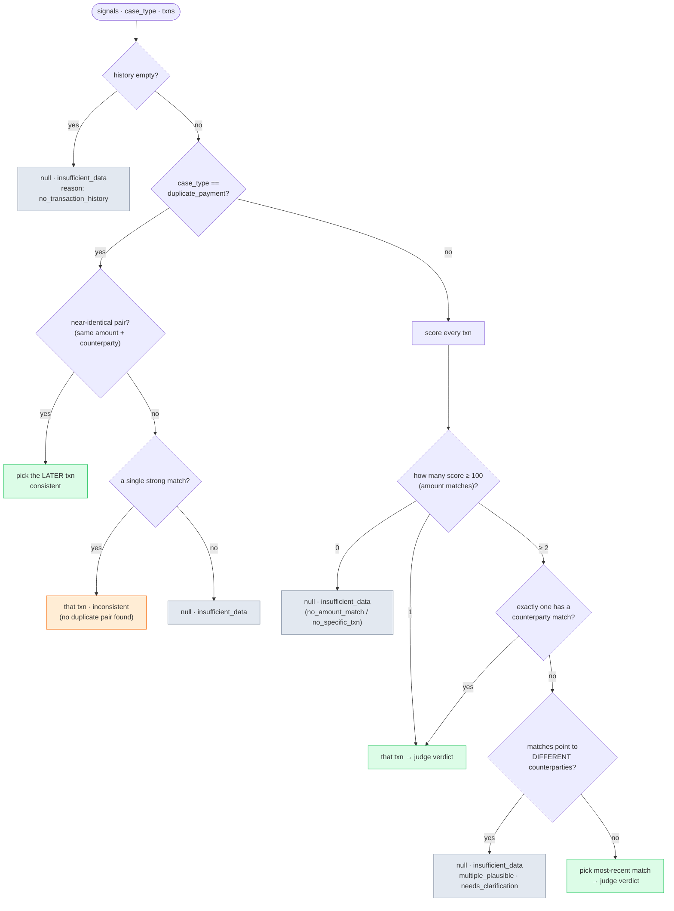
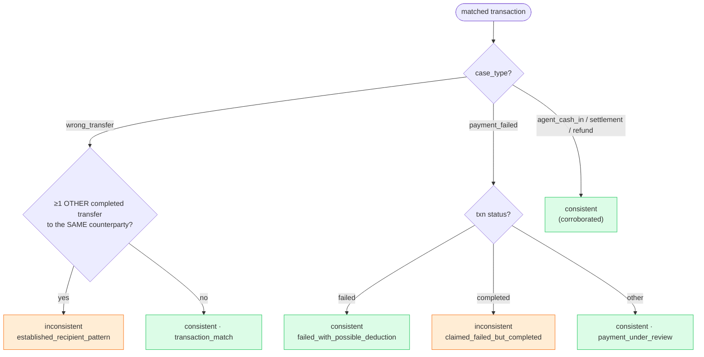
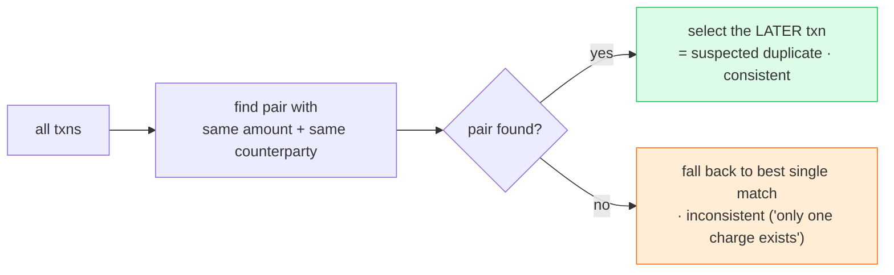

# 07 · ⚖️ Evidence Matching & Verdict

[◀ Classification](../06-classification/README.md) · [🏠 Docs Home](../README.md) · [Next ▶ Routing & Severity](../08-routing-and-severity/README.md)

---

This is the **heart of the service** — the part that makes it an *investigator*. Given the complaint
signals, the chosen `case_type`, and the transaction history, it decides **two** of the six scored
fields:

| Field | Possible values |
|-------|-----------------|
| `relevant_transaction_id` | a real `transaction_id` from history, **or `null`** |
| `evidence_verdict` | `consistent` · `inconsistent` · `insufficient_data` |

📄 Source: [`domain/matching.py`](../../src/queuestorm/domain/matching.py) ·
🧪 Tests: [`tests/unit/test_matching_routing.py`](../../tests/unit/test_matching_routing.py)

> **The discipline that gets graded:** when several transactions plausibly match and **nothing
> disambiguates**, return `null` + `insufficient_data` rather than guessing. Guessing to "look
> confident" is the exact mistake the rubric punishes — it risks opening an unnecessary dispute.

---

## 🎚️ Scoring signals (priority order)

Each transaction is scored against the complaint. The weights encode the priority:

| Signal | Points | Meaning |
|--------|:------:|---------|
| **Amount match** | **+100** | complaint amount == txn `amount` (after comma/Bangla-digit normalization) — the **bar** for a real match |
| **Counterparty match** | +50 | a phone/merchant/agent id in the complaint matches the txn `counterparty` (decisive disambiguator) |
| **Status `failed`** | +15 | `payment_failed` case + txn status `failed` |
| **Type match** | +12 | txn `type` is expected for this case type |
| **Status `pending`** | +12 | "not received" + a `pending` txn corroborates |

A transaction must reach **≥ 100** (i.e. clear the amount bar) to be considered a "strong" match.
Type/status/counterparty alone never select a transaction.

> **Time cues are SOFT only.** "around 2pm", "yesterday", "আজ সকালে" rank candidates but **never
> reject** one. The service does **no timezone math** — `2026-04-14T14:08:22Z` is 8:08 PM Dhaka yet
> still matches "around 2pm".

---

## 🏃 Matching decision tree (activity)



This single diagram captures the whole `match()` function. The three `null` outcomes (empty history,
no amount match, multiple-plausible) are exactly SAMPLE-05, SAMPLE-06, and SAMPLE-08.

---

## 🔁 The verdict tree (for a single matched txn)

Once a transaction is matched, the verdict **defaults to `consistent`** and is downgraded only when
the data **contradicts** the complaint's premise. Implemented in `_verdict_for_single()`.



### The three verdicts in plain words

| Verdict | Meaning | Canonical trigger |
|---------|---------|-------------------|
| **`consistent`** | data corroborates the story | failed payment + "deducted" (03); pending cash-in/settlement + "not received" (07, 09); real payment behind a change-of-mind refund (04); duplicate pair present (10) |
| **`inconsistent`** | data actively **contradicts** the story | **established-recipient pattern**: claimed "wrong transfer" but ≥1 prior `completed` transfer to the *same* counterparty (**SAMPLE-02**); "failed" but the only match is `completed` |
| **`insufficient_data`** | can't tell | **always** when `relevant_transaction_id` is `null` — empty (05), vague (06), or ambiguous/multi-plausible (08) |

> 🔑 **A `null` id ⇒ always `insufficient_data`.** Never `consistent`/`inconsistent` with a null id.

---

## 🧪 Worked examples from the samples

### SAMPLE-02 — established recipient → `inconsistent`
Complaint: "wrong transfer of 2000". History has three transfers — only **`TXN-9202`** is 2000 BDT,
so the **unique-amount** signal picks it (just like 01/03/04). But all three transfers go to the
**same counterparty** (`+8801812345678`), so `_established_recipient()` fires → verdict
`inconsistent`. The shared counterparty drives the *verdict*, **not** the id selection.

> ⚠️ **Do not** learn "pick the newest of several equal-amount transfers" from SAMPLE-02 — it is a
> *unique-amount* match. No public sample exercises the same-amount tie-break.

### SAMPLE-08 — genuinely ambiguous → `null`
Three transfers of 1000 BDT each, to **two different recipients**, and the complaint names no
disambiguating counterparty. `distinct_cps > 1` → `null` + `insufficient_data` + `needs_clarification`.
Case type stays `wrong_transfer`.

### SAMPLE-10 — duplicate → the **second** txn
Two near-identical charges (same amount + counterparty, seconds apart). `_duplicate_pair()` returns
the **later** transaction (`TXN-10002`, the *suspected* duplicate) → `consistent`.

---

## Special path: `duplicate_payment`

Duplicates are matched differently because the signal is **a pair**, not a single amount:



---

## Output: the `MatchResult` object

```python
MatchResult(
    relevant_transaction_id: str | None,   # a real id, or None
    evidence_verdict:        EvidenceVerdict,
    reason_codes:            list[str],     # e.g. ["amount_match","established_recipient_pattern"]
    ambiguous:               bool = False,  # True on the multi-plausible → null path
)
```

These two fields, plus `case_type`, drive **all** downstream routing decisions in
[Chapter 08](../08-routing-and-severity/README.md).

---

[◀ Classification](../06-classification/README.md) · [🏠 Docs Home](../README.md) · [Next ▶ Routing & Severity](../08-routing-and-severity/README.md)
