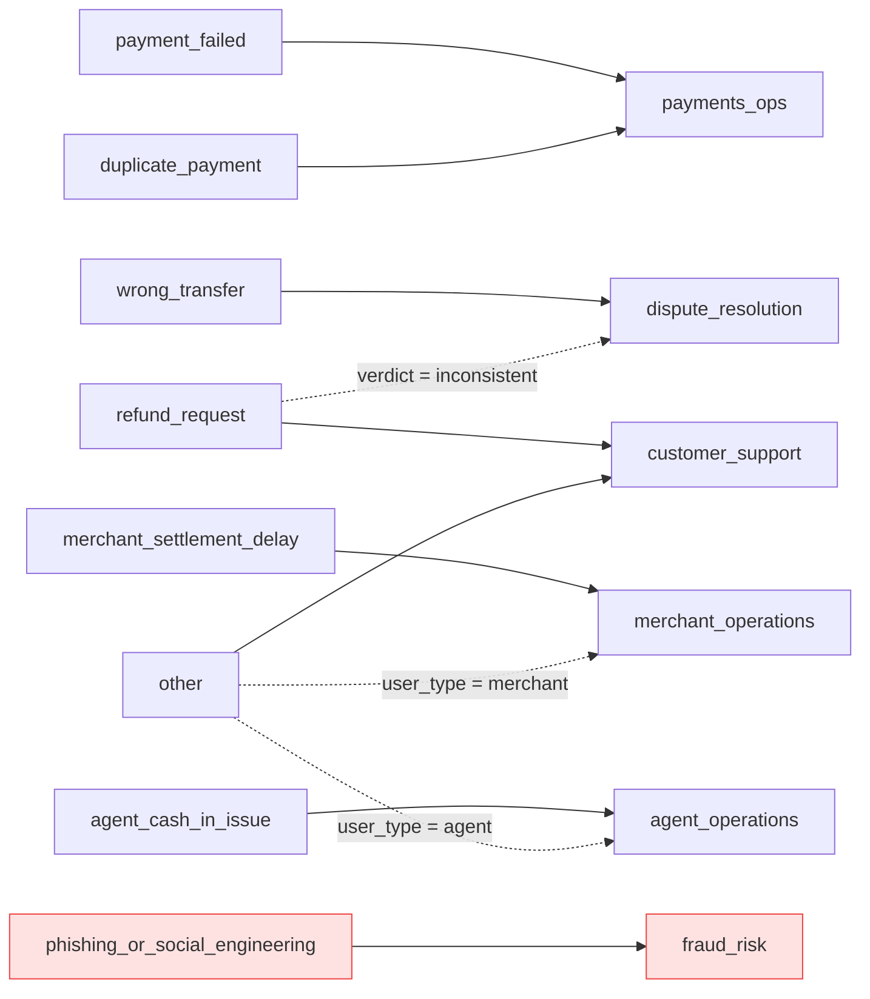
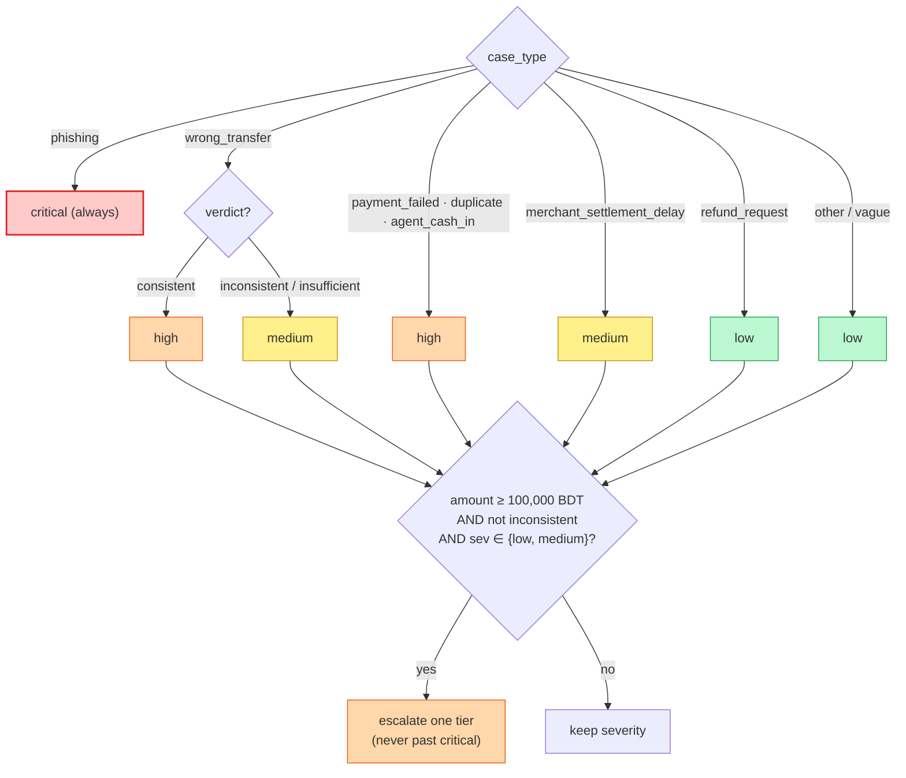
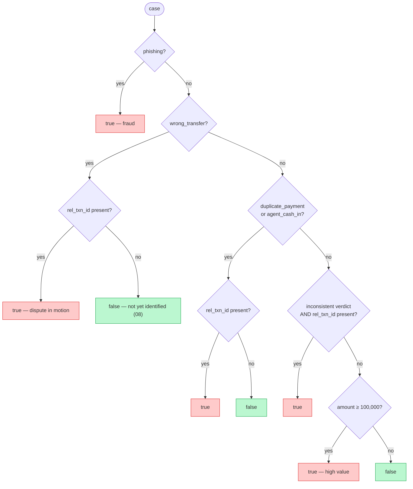

# 08 · 🧭 Routing, Severity & Human Review

[◀ Evidence Matching](../07-evidence-matching/README.md) · [🏠 Docs Home](../README.md) · [Next ▶ Safety System](../09-safety-system/README.md)

---

**Stages ⑤⑥⑦.** Three pure functions turn the decided fields (`case_type`, `evidence_verdict`,
`relevant_transaction_id`, `primary_amount`, `user_type`) into the last three scored fields:
`department`, `severity`, `human_review_required`.

📄 Source: [`domain/routing.py`](../../src/queuestorm/domain/routing.py) ·
🧪 Tests: [`tests/unit/test_matching_routing.py`](../../tests/unit/test_matching_routing.py)

---

## 🗺️ Department routing (stage ⑤)

Base routing is a **pure function of `case_type`**. `user_type` *confirms* merchant/agent routes (it
never overrides), and a contested/failure-driven refund escalates to disputes.

| `case_type` | `department` |
|-------------|--------------|
| `wrong_transfer` | `dispute_resolution` |
| `refund_request` (change-of-mind) | `customer_support` |
| `refund_request` (contested / `inconsistent`) | `dispute_resolution` |
| `payment_failed` | `payments_ops` |
| `duplicate_payment` | `payments_ops` |
| `merchant_settlement_delay` | `merchant_operations` |
| `agent_cash_in_issue` | `agent_operations` |
| `phishing_or_social_engineering` | `fraud_risk` |
| `other` / vague | `customer_support` (→ merchant/agent ops if `user_type` says so) |

> **`user_type` influence (SAMPLE-09):** `merchant` keeps `merchant_operations` and shifts the reply
> to **business-formal** tone (no "thank you for reaching out"); `agent` confirms `agent_operations`.
> When `case_type = other`, `user_type` can redirect `customer_support` → merchant/agent ops.

---

## 🌡️ Severity (stage ⑥)

A default per `case_type`, adjusted by verdict and (rarely) a high-value escalator.

| Condition | `severity` |
|-----------|:----------:|
| `phishing_or_social_engineering` | **critical** (always) |
| `wrong_transfer` (consistent) | high |
| `payment_failed` / `duplicate_payment` / `agent_cash_in_issue` | high |
| `wrong_transfer` (inconsistent / insufficient) | medium |
| `merchant_settlement_delay` | medium |
| `refund_request` (change-of-mind) | low |
| `other` / vague | low |

> ⚠️ **The high-value escalator is a deliberate, NON-AUTHORITATIVE heuristic.** No source defines a
> cutoff. `HIGH_VALUE_FLOOR = 100,000 BDT` sits **well above** the largest sample (15,000 BDT) so it
> **never alters a public sample** — it only escalates clearly atypical hidden-test amounts. An
> `inconsistent` verdict on a money-movement dispute **caps severity** (we don't scream "high" on a
> claim the data contradicts — SAMPLE-02 stays `medium`).

---

## 🙋 Human review required (stage ⑦)

The subtle one. It asks **"does this need human judgment on a dispute/risk NOW?"** — *not* "is this
serious?". Serious-but-procedural cases are `false`.

### `true` when (any)
- **Fraud/suspicious** — `phishing_or_social_engineering` (even with empty history, SAMPLE-05).
- **Money-movement dispute that triggers a workflow** — `wrong_transfer` (01, 02),
  `duplicate_payment` (10), `agent_cash_in_issue` with a matched txn (07).
- **`inconsistent` evidence** on a dispute with a matched txn (02), or a **high-value** amount.

### `false` when (the graded, counter-intuitive cases)
| Sample | Case | Why `false` |
|--------|------|-------------|
| 03 | `payment_failed` | standard automatic reversal/SLA flow — procedural, no adjudication |
| 04 | `refund_request` (change-of-mind) | outcome depends on **merchant policy**, not an internal dispute |
| 06 | vague / `other` | nothing to review yet — next step is "ask the customer" |
| 08 | ambiguous `wrong_transfer` | potential dispute, but **don't escalate until the txn is identified** |
| 09 | `merchant_settlement_delay` | routine ops check on a pending batch + ETA |

> When genuinely torn between fraud and benign — **escalate.** Over-escalation costs nothing on
> safety; under-escalation risks the disqualifier. See [Ch. 09](../09-safety-system/README.md).

---

## How the three combine (one example)

> **SAMPLE-02** — `wrong_transfer`, verdict `inconsistent`, `TXN-9202` matched →
> `department = dispute_resolution`, `severity = medium` (capped by inconsistent),
> `human_review_required = true` (dispute in motion + inconsistent evidence).

The full field-by-field table for all 10 samples is in
**[Chapter 14 — Decision Matrix](../14-decision-matrix/README.md)**.

---

[◀ Evidence Matching](../07-evidence-matching/README.md) · [🏠 Docs Home](../README.md) · [Next ▶ Safety System](../09-safety-system/README.md)
