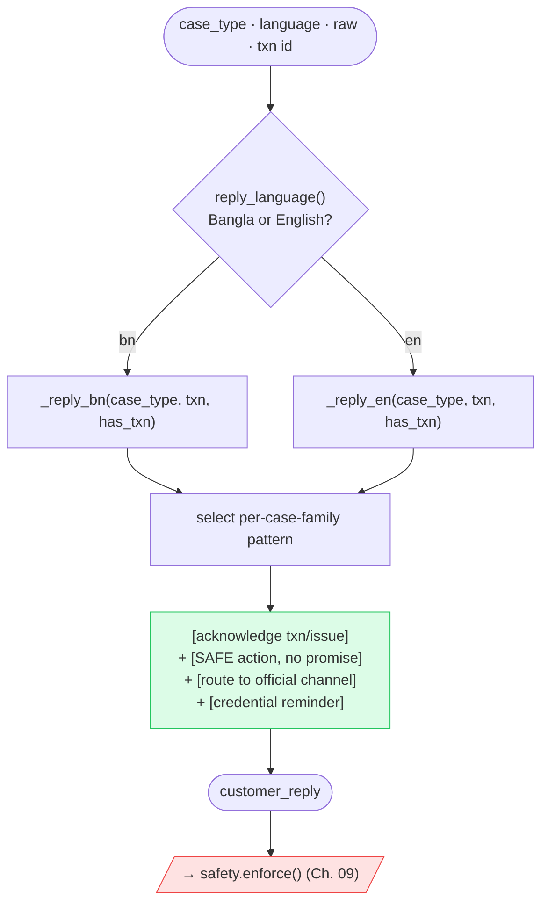
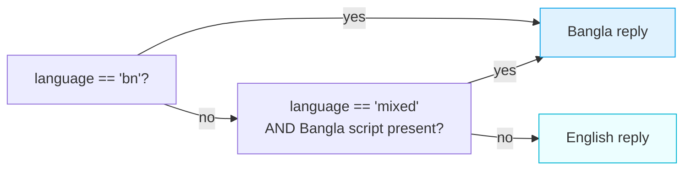

# 10 · ✍️ Text Generation (Templates)

[◀ Safety System](../09-safety-system/README.md) · [🏠 Docs Home](../README.md) · [Next ▶ Reliability & Performance](../11-reliability-and-performance/README.md)

---

**Stage ⑧.** Once the six scored fields are fixed, three text fields are drafted from **deterministic,
safe-by-construction templates**. They are then handed to the safety filter
([Ch. 09](../09-safety-system/README.md)) as an independent second guarantee.

📄 Source: [`domain/templates.py`](../../src/queuestorm/domain/templates.py)

| Field | Audience | Language |
|-------|----------|----------|
| `agent_summary` | internal (agent) | English |
| `recommended_next_action` | internal (agent) | English |
| `customer_reply` | customer-facing | **mirrors the complaint** (EN or BN) |

> **Why templates, not raw model output?** The judge auto-scores safety and partly reads quality.
> Templates are deterministic, safe, fast, and free — and they already name the txn id, amount, and
> the conflict, which is exactly what the manual Response-Quality rubric rewards.

---

## 🏃 Reply construction (activity)



The universal recipe:

> **[acknowledge specific txn/issue] + [SAFE action language, no promise] + [route to official
> channel] + [credential reminder, same language]** — 1–3 sentences, professional, no emojis.

---

## 🌐 Reply-language selection



A Bangla complaint → Bangla reply + Bangla reminder (SAMPLE-07). Mixed/Banglish → dominant language,
Bangla reminder if Bangla script is present, else English. (Tie-breaker #6 rewards Bangla/Banglish
quality.)

---

## 📨 `customer_reply` per case family

Every reply is safe by construction and ends with the credential reminder (except pure
merchant-settlement, where it is optional).

| `case_type` | Reply shape (English; Bangla mirror exists) |
|-------------|---------------------------------------------|
| `wrong_transfer` (matched) | "We have noted your concern about transaction `{TXN}`. Our dispute resolution team will review the case and contact you through official support channels. + reminder" |
| `wrong_transfer` (ambiguous, no txn) | "…we see more than one transaction that could match. Could you share the recipient's number…? + reminder" |
| `payment_failed` | "…transaction `{TXN}` may have caused an unexpected balance deduction. …**any eligible amount will be returned through official channels**. + reminder" |
| `duplicate_payment` | "…possible duplicate payment for `{TXN}`. …verify with the biller and **any eligible amount will be returned through official channels**. + reminder" |
| `refund_request` | "**Refunds for completed merchant payments depend on the merchant's own policy.** We recommend contacting the merchant directly… + reminder" |
| `merchant_settlement_delay` | "…settlement `{TXN}`. Our merchant operations team will check the batch status and update you… *(business-formal; reminder optional)*" |
| `agent_cash_in_issue` | "…transaction `{TXN}`. Our agent operations team will verify it and update you… + reminder" |
| `phishing_or_social_engineering` | "Thank you for reaching out before sharing any information. **We never ask for your PIN, OTP, or password under any circumstances.** … Our fraud team has been notified." |
| vague / `other` | "To help you faster, please share the transaction ID, the amount involved, and a short description… + reminder" |

> Notice the **safe phrasings**: *"any eligible amount will be returned through official channels"*
> (never "we will refund"), and *"contact the merchant directly"* (an official counterparty, allowed)
> — never a number surfaced by a scammer.

---

## 🧾 `agent_summary` — names the evidence

Internal, English, 1–2 sentences. It explicitly names the **txn id + amount + the conflict** — the
exact signal the Response-Quality rubric rewards. The actor label adapts to `user_type`
(Customer / Merchant / Agent).

> Example (SAMPLE-02): *"Customer claims TXN-9202 (2000 BDT) was a wrong transfer, but the history
> shows prior completed transfers to the same recipient, suggesting an established counterparty."*

---

## 🔧 `recommended_next_action` — verb-led & safe

Internal, English, **verb-led**, and **conditional/verification-first** where money moves — so it
never reads as a guaranteed action (P2-safe).

> Example (SAMPLE-10 duplicate): *"Verify the duplicate with payments_ops. **If the biller confirms**
> a single charge, initiate reversal of TXN-10002 per policy."* — conditional, so it passes P2.

After drafting, it still goes through `safety.enforce()`, which would rewrite any accidental
unconditional confirmation.

---

## Constants worth knowing

```python
PIN_REMINDER_EN = "Please do not share your PIN or OTP with anyone."
PIN_REMINDER_BN = "অনুগ্রহ করে কারো সাথে আপনার পিন বা ওটিপি শেয়ার করবেন না।"
```

These are single canonical strings so the safety filter can both **enforce their presence** and
**verify they are the safe ones** (whitelist).

---

[◀ Safety System](../09-safety-system/README.md) · [🏠 Docs Home](../README.md) · [Next ▶ Reliability & Performance](../11-reliability-and-performance/README.md)
