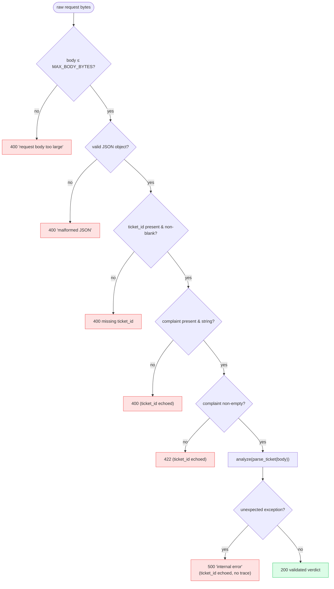
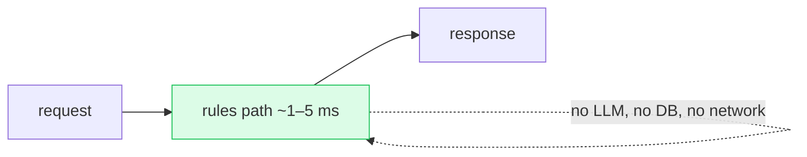
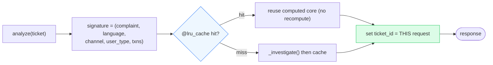

# 11 · ⚡ Reliability & Performance

[◀ Text Generation](../10-text-generation/README.md) · [🏠 Docs Home](../README.md) · [Next ▶ Deployment](../12-deployment/README.md)

---

Performance & Reliability is **10/100**, auto-scored. The whole design is built around one
**golden invariant**:

> **Every valid request returns a schema-valid 200 within budget; every invalid request returns a
> controlled 4xx; the process never exits.** The rule path is independently sufficient, so an
> LLM/ML outage degrades quality, never availability.

📄 Source: [`api/routes/analyze.py`](../../src/queuestorm/api/routes/analyze.py) ·
[`api/errors.py`](../../src/queuestorm/api/errors.py) ·
[`domain/investigator.py`](../../src/queuestorm/domain/investigator.py) ·
[`core/config.py`](../../src/queuestorm/core/config.py)

---

## 🛟 Never-crash request handling (activity)

Key defenses:

- **Tolerant parsing** ([`parsing.py`](../../src/queuestorm/domain/parsing.py)) coerces or skips bad
  optional fields — junk transaction entries are dropped, not fatal.
- A **top-level `try/except`** around `analyze()` turns any unexpected error into a controlled 500
  with the `ticket_id` echoed and **no** stack trace.
- **`MAX_BODY_BYTES`** (default 256 KB) rejects oversized bodies early.
- Empty `transaction_history: []` is **normal** (safety-only cases) → `relevant_transaction_id: null`.

---

## ⏱️ Latency budget

| Enforced metric | Threshold | How it's met |
|-----------------|-----------|--------------|
| p95 latency | ≤ 5 s full / ≤ 15 s partial / ≤ 30 s minimal | Rules path returns in **~1–5 ms** |
| Per-request hard timeout | **30 s = failure** | No outbound network calls in the judged path → no timeout risk |
| Health readiness | `{"status":"ok"}` within **60 s** | `/health` is static, dependency-free |
| Failure rate | no 5xx / invalid JSON on valid input | top-level fallback always returns valid output |

**Measured (4 gunicorn workers, laptop):** ~**2,800 req/s**, p50 ≈ 11 ms, p95 ≈ 20 ms — far inside
every threshold.

Because there is **no LLM in the judged path**, the latency distribution is essentially the
serialization cost — the 30 s timeout and 5 s p95 targets are never in play.

---

## 🗃️ Content-keyed LRU cache

- The signature **excludes `ticket_id`**, so retries / identical content hit the cache while each
  response still echoes the correct per-request `ticket_id`.
- Size: `CACHE_SIZE` env (default **2048**). The cache is a pure speed optimization — correctness
  never depends on it.

---

## 📈 Horizontal scalability

The service is **stateless** (the cache is a per-process optimization, not shared state), so it scales
by adding worker processes / replicas.

- **Production:** `gunicorn -c deploy/gunicorn_conf.py` runs `UvicornWorker`s, `workers ≈ CPU count`
  (override `WEB_CONCURRENCY`), `preload_app=True` so the optional model loads **once** in the master
  and is shared copy-on-write across forks.
- Workers recycle (`max_requests` with jitter) to bound memory; `timeout=30s` matches the contract.

→ See [Ch. 12 — Deployment](../12-deployment/README.md) for the gunicorn config and Docker setup.

---

## 🔭 Observability (without leaking secrets)

- **Middleware** ([`middleware.py`](../../src/queuestorm/api/middleware.py)) adds an
  `X-Process-Time-ms` header to every response and logs `analyze status=… latency_ms=…`.
- **Logging** ([`logging.py`](../../src/queuestorm/core/logging.py)) never logs secrets, tokens, or
  full payloads.
- **`reason_codes`** in the response double as a per-request audit trail (which rules fired, whether
  the safety filter changed anything).

---

## 🔐 Secrets & cost

- **Env vars only.** `.env` / `judging.env` are git-ignored; `.env.example` carries names only.
- **No secrets** in repo, logs, responses, errors, or image. The 500 handler returns a generic body.
- **Cost = $0.** No third-party API keys, no metered calls, no runtime downloads. Quota / rate-limit
  / provider-outage risk during judging is **structurally impossible** for the scored path.

---

[◀ Text Generation](../10-text-generation/README.md) · [🏠 Docs Home](../README.md) · [Next ▶ Deployment](../12-deployment/README.md)
