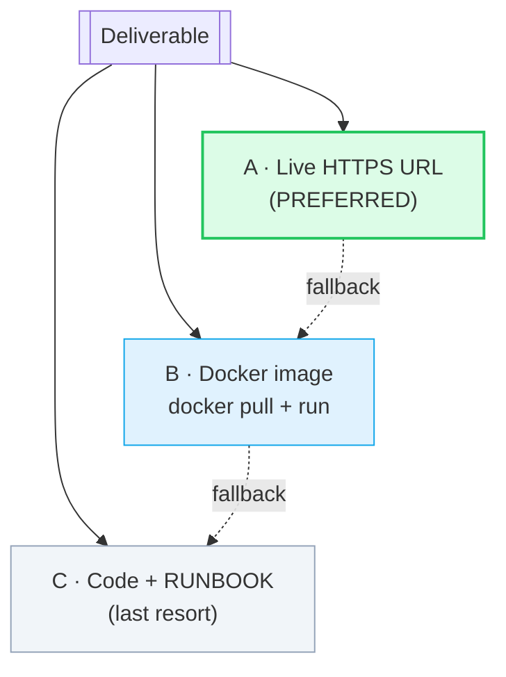
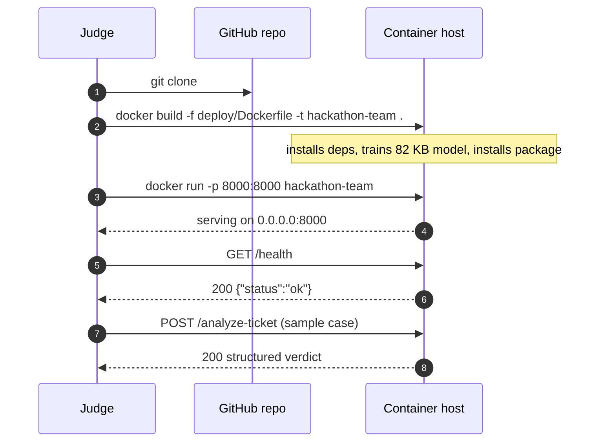

# 12 · 🚀 Deployment

[◀ Reliability & Performance](../11-reliability-and-performance/README.md) · [🏠 Docs Home](../README.md) · [Next ▶ Testing & Validation](../13-testing-and-validation/README.md)

---

Deployment & Reproducibility is **5/100** plus reliability/reachability points in Stage 1. The goal:
**zero judge intervention** — a public HTTPS URL **plus** a copy-paste runbook so judges can redeploy
if the URL dies mid-evaluation.

📄 Sources: [`deploy/Dockerfile`](../../deploy/Dockerfile) ·
[`deploy/gunicorn_conf.py`](../../deploy/gunicorn_conf.py) ·
[`deploy/docker-compose.yml`](../../deploy/docker-compose.yml) ·
[`RUNBOOK.md`](../../RUNBOOK.md) · [`scripts/smoke.sh`](../../scripts/smoke.sh)

---

## 🧭 Deployment options (ranked by judge preference)



> **Always ship `RUNBOOK.md` even with a live URL** — judges re-deploy if the URL dies. It is
> copy-paste-perfect: clone → install → run → curl.

---

## 🅰️ Local (Python)

```bash
python3 -m venv .venv && . .venv/bin/activate     # Windows: .venv\Scripts\activate
pip install -r requirements.txt && pip install -e .

# optional: train the ~82 KB local fallback classifier (service runs fine without it)
python scripts/train_classifier.py

# run (prod, multi-worker) — or uvicorn for single-worker dev
gunicorn -c deploy/gunicorn_conf.py queuestorm.main:app
# uvicorn queuestorm.main:app --host 0.0.0.0 --port 8000

curl http://localhost:8000/health                  # {"status":"ok"}
BASE_URL=http://localhost:8000 bash scripts/smoke.sh
```

`make help` lists every developer task (`install`, `dev`, `train`, `run`, `run-prod`, `test`,
`lint`, `sample`, `smoke`, `docker-build`, `docker-run`).

---

## 🅱️ Docker

```bash
docker build -f deploy/Dockerfile -t hackathon-team .
docker run -p 8000:8000 hackathon-team
# or: docker compose -f deploy/docker-compose.yml up --build
```

The image ([`deploy/Dockerfile`](../../deploy/Dockerfile)):

| Property | Value |
|----------|-------|
| Base | `python:3.11-slim` (target **< 500 MB**, 1 GB hard cap) |
| User | non-root (`appuser`, uid 10001) |
| Binds | `0.0.0.0:8000` |
| Health | built-in `HEALTHCHECK` hitting `/health` |
| Model | trained **at build time** so it matches the installed sklearn; ships as package data |
| Secrets | **none** in the image |
| Runtime | no GPU, no large weights, **no runtime downloads** |

> The build installs `libgomp1` (OpenMP runtime needed by scipy/scikit-learn) and trains the
> classifier before `pip install --no-deps .` so the artifact and the library versions always agree.

---

## ⚙️ Configuration (all optional — safe defaults)

Sourced exclusively from environment variables ([`core/config.py`](../../src/queuestorm/core/config.py)).

| Env var | Default | Purpose |
|---------|---------|---------|
| `PORT` | `8000` | Listen port |
| `HOST` | `0.0.0.0` | Bind address (mandatory `0.0.0.0`) |
| `WEB_CONCURRENCY` | CPU count | gunicorn worker processes |
| `USE_ML_FALLBACK` | `true` | Enable the optional local classifier |
| `ML_CONFIDENCE_THRESHOLD` | `0.45` | Min probability to accept a fallback prediction |
| `ML_MODEL_PATH` | packaged artifact | Override the classifier path |
| `CACHE_SIZE` | `2048` | LRU cache entries |
| `MAX_BODY_BYTES` | `262144` | Reject oversized bodies (→ 400) |
| `LOG_LEVEL` | `INFO` | Log verbosity |

`.env.example` carries **names only** — no real values. The service runs fully offline with **zero**
configuration.

---

## 🚢 Hosting & the cold-start risk

The **#1 live-URL risk** is cold start: the 60 s health window resets each time the judge first-hits
a sleeping service.

| Host | Cold-start behavior | Role |
|------|---------------------|------|
| **Render (free)** | Sleeps after 15 min idle; 30–50 s to wake | Recommended primary (HTTPS by default) |
| **Railway** | Less aggressive sleep; small free credit | Recommended backup |
| **Fly.io** | Set `min_machines_running=1` to avoid cold start | Strong if comfortable with CLI |

**Mitigations:** pin to "always on", and/or run an external uptime pinger on `/health` every
5–10 min through the judging window. **Always test `/health` and `/analyze-ticket` from OUTSIDE the
host** before submitting (`scripts/smoke.sh`).

---

## 🔁 Judge re-deploy sequence



---

## ✅ Deployment checklist

- [ ] Live HTTPS URL reachable (no login) **and** verified from an external network minutes before cutoff
- [ ] `RUNBOOK.md` committed and copy-paste-perfect
- [ ] Docker image builds clean and runs, binds `0.0.0.0:8000`, < 500 MB
- [ ] No secrets in repo / image / logs; `.env` git-ignored
- [ ] Organizer handle `bipulhf` has repo read access
- [ ] `scripts/smoke.sh` passes against the live URL

---

[◀ Reliability & Performance](../11-reliability-and-performance/README.md) · [🏠 Docs Home](../README.md) · [Next ▶ Testing & Validation](../13-testing-and-validation/README.md)
