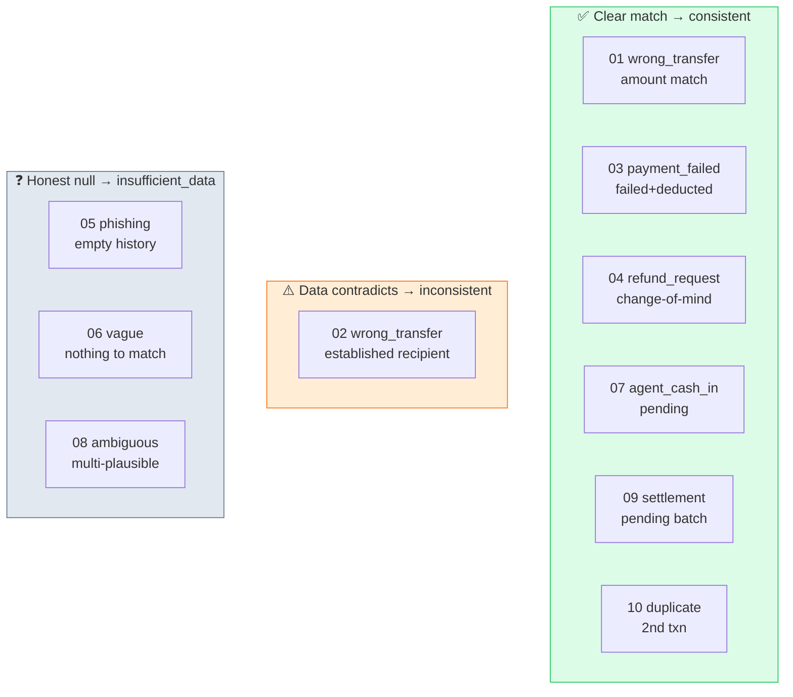

# 14 · 📊 Decision Matrix Reference

[◀ Testing & Validation](../13-testing-and-validation/README.md) · [🏠 Docs Home](../README.md)

---

The canonical reference table for the **10 public sample cases**. The six scored fields must match
this table **exactly** — it is the self-test gate before every deploy.

> 📄 Full request/response for each case: [`sample_output.json`](../../sample_output.json) ·
> source cases: `SUST_Preli_Sample_Cases.json` (the problem statement also calls this
> `QueueStorm_Preli_Sample_Cases.json`).
>
> ⚠️ **These 10 answers are NOT hard-coded.** Hidden tests are broader; the engine derives every
> field from general rules and is validated *against* — not *to* — these samples.

---

## The matrix

| # | `rel_txn_id` | `evidence_verdict` | `case_type` | `department` | `severity` | `human_review` |
|:-:|--------------|--------------------|-------------|--------------|:----------:|:--------------:|
| 01 | `TXN-9101` | `consistent` | `wrong_transfer` | `dispute_resolution` | `high` | **true** |
| 02 | `TXN-9202` | `inconsistent` | `wrong_transfer` | `dispute_resolution` | `medium` | **true** |
| 03 | `TXN-9301` | `consistent` | `payment_failed` | `payments_ops` | `high` | **false** |
| 04 | `TXN-9401` | `consistent` | `refund_request` | `customer_support` | `low` | **false** |
| 05 | `null` | `insufficient_data` | `phishing_or_social_engineering` | `fraud_risk` | `critical` | **true** |
| 06 | `null` | `insufficient_data` | `other` | `customer_support` | `low` | **false** |
| 07 | `TXN-9701` | `consistent` | `agent_cash_in_issue` | `agent_operations` | `high` | **true** |
| 08 | `null` | `insufficient_data` | `wrong_transfer` | `dispute_resolution` | `medium` | **false** |
| 09 | `TXN-9901` | `consistent` | `merchant_settlement_delay` | `merchant_operations` | `medium` | **false** |
| 10 | `TXN-10002` | `consistent` | `duplicate_payment` | `payments_ops` | `high` | **true** |

---

## 🗺️ The cases by reasoning pattern

---

## 🔎 Per-case walkthrough

| # | What happens & why |
|:-:|--------------------|
| **01** | "sent 5000 to wrong number" + a 5000 `transfer`. Amount match → `TXN-9101`; no prior transfer to that recipient → `consistent`; wrong-transfer dispute → `dispute_resolution`, `high`, review **true**. |
| **02** | "wrong transfer of 2000" — only `TXN-9202` is 2000 (unique-amount pick). But 3 prior **completed** transfers to the **same** counterparty → **`inconsistent`** (established recipient). Severity **capped at medium**; review **true** (inconsistent dispute). |
| **03** | "failed but deducted" + a `failed` payment → `consistent`. Procedural reversal/SLA flow → `payments_ops`, `high`, review **false** (no adjudication). |
| **04** | Change-of-mind refund on a real completed merchant payment → `refund_request`, `consistent`, `customer_support`, `low`, review **false** (depends on merchant policy). |
| **05** | Phishing/OTP-harvest call, **empty history** → `null` + `insufficient_data`. Always `critical`, `fraud_risk`, review **true** — even with no transaction. |
| **06** | Vague "something's wrong with my money" → no match → `null`, `insufficient_data`, `other`, `customer_support`, `low`, review **false** (ask for details first). |
| **07** | Agent cash-in not in balance + a `pending` cash_in → `TXN-9701`, `consistent`, `agent_operations`, `high`, review **true**. Reply often Bangla (SAMPLE-07). |
| **08** | "sent money, not received" but **3×1000 to two recipients**, no disambiguator → `null` + `insufficient_data`. Stays `wrong_transfer` / `dispute_resolution`, `medium`, review **false** (don't escalate until identified). |
| **09** | Merchant settlement delayed + a `pending` settlement → `TXN-9901`, `consistent`, `merchant_operations`, `medium`, review **false** (routine ops). Business-formal reply (merchant). |
| **10** | "deducted twice" + a near-identical pair → the **later** txn `TXN-10002`, `consistent`, `payments_ops`, `high`, review **true**. |

---

## 🚩 The traps this matrix encodes

1. **Three `null` ids** (05, 06, 08) — honest `insufficient_data`, never a guess.
2. **SAMPLE-02** — unique-amount selection ≠ same-amount tie-break; verdict driven by the shared
   counterparty, not the id pick.
3. **SAMPLE-10** — the **second** transaction (the suspected duplicate), not the first.
4. **Four `human_review = false`** rows (03, 04, 06, 08, 09) — serious-but-procedural,
   policy-dependent, or not-yet-actionable.
5. **`case_type` independent of evidence** — SAMPLE-08 keeps `wrong_transfer` despite a `null` id.

Cross-references: classification → [Ch. 06](../06-classification/README.md), matching/verdict →
[Ch. 07](../07-evidence-matching/README.md), routing → [Ch. 08](../08-routing-and-severity/README.md).

---

[◀ Testing & Validation](../13-testing-and-validation/README.md) · [🏠 Docs Home](../README.md)
