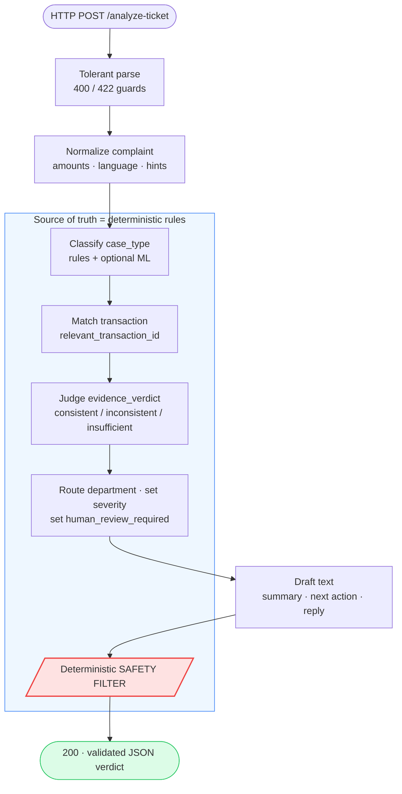

# 📚 QueueStorm Investigator — Documentation

> **Team Aquila** (Shagato & Munia) · bKash presents **SUST CSE Carnival 2026 — Codex Community Hackathon**
> Online Preliminary Round: *AI/API SupportOps Challenge for Digital Finance*

Welcome to the complete documentation for the **QueueStorm Investigator** — an evidence-grounded
support copilot API for digital finance. This documentation explains **every part of the system**:
the mission, the architecture, the decision logic, the safety guardrails, deployment, and testing —
with **activity, sequence, and use-case diagrams** throughout.

---

## 🧭 What is this service in one breath?

It reads **one customer complaint** plus a **snippet of recent transactions** and returns **one
structured JSON verdict**. It is a **complaint _investigator_, not a classifier**: the complaint
says one thing, the data may say another, and the service decides **what is actually true** — or
honestly says `insufficient_data` when the evidence is unclear.

```text
POST /analyze-ticket   →  { verdict, case_type, department, severity, safe reply, … }
GET  /health           →  { "status": "ok" }
```

---

## 🗂️ Documentation map

Read top-to-bottom for a full understanding, or jump to any topic. Each folder is a self-contained
chapter with its own `README.md` and diagrams.

| # | Chapter | What it covers | Key diagrams |
|---|---------|----------------|--------------|
| 00 | **[Documentation Home](README.md)** | This page — the master index | map |
| 01 | **[Overview & Mission](01-overview/README.md)** | The problem, the "investigator twist", actors, scoring | 🎭 Use case |
| 02 | **[System Architecture](02-architecture/README.md)** | Layers, components, data flow, tech stack | 🧱 Component · 🔭 Container |
| 03 | **[API Contract](03-api-contract/README.md)** | Endpoints, request/response schema, enums, status codes | 🔁 Sequence |
| 04 | **[Investigation Pipeline](04-investigation-pipeline/README.md)** | The 8-stage orchestrator + content cache | 🏃 Activity · 🔁 Sequence |
| 05 | **[Normalization & Signals](05-normalization/README.md)** | Amounts, language, counterparty, status cues | 🏃 Activity |
| 06 | **[Case-Type Classification](06-classification/README.md)** | Keyword rules, tie-break, ML fallback | 🏃 Activity |
| 07 | **[Evidence Matching & Verdict](07-evidence-matching/README.md)** | `relevant_transaction_id` + `evidence_verdict` | 🏃 Activity (decision tree) |
| 08 | **[Routing, Severity & Review](08-routing-and-severity/README.md)** | `department`, `severity`, `human_review_required` | 🏃 Activity |
| 09 | **[Safety System](09-safety-system/README.md)** | The output safety filter, P1/P2/P3, injection defense | 🏃 Activity · 🔁 Sequence |
| 10 | **[Text Generation](10-text-generation/README.md)** | Safe-by-construction multilingual replies | 🏃 Activity |
| 11 | **[Reliability & Performance](11-reliability-and-performance/README.md)** | Never-crash, caching, latency budget | 🏃 Activity |
| 12 | **[Deployment](12-deployment/README.md)** | Docker, gunicorn, hosting, runbook | 🔁 Sequence |
| 13 | **[Testing & Validation](13-testing-and-validation/README.md)** | 71 tests, red-team, scoring | 🏃 Activity |
| 14 | **[Decision Matrix Reference](14-decision-matrix/README.md)** | All 10 sample cases, field-by-field | tables |

> 📁 **[`diagrams/`](diagrams/README.md)** collects the headline system-wide diagrams in one place
> for quick reference and presentations.

---

## 🧩 The big picture (one diagram)



**The golden rule:** the deterministic rule engine decides **all six scored fields** and runs the
**safety filter**. Any LLM/ML is *optional polish* that can never decide a scored field or weaken
safety. If every model is unavailable, the service still returns a correct, safe, schema-valid answer.

---

## 🏆 Why the design looks like this (scoring map)

The judge harness auto-scores ~80 of 100 points with **no human in the loop**:

| Category | Weight | How this system wins it |
|----------|:------:|-------------------------|
| Evidence Reasoning | **35** | Deterministic matcher + verdict engine → [Ch. 07](07-evidence-matching/README.md) |
| Safety & Escalation | **20** | Code-level output filter, safe templates → [Ch. 09](09-safety-system/README.md) |
| API Contract & Schema | **15** | `StrEnum` response model, single source of truth → [Ch. 03](03-api-contract/README.md) |
| Performance & Reliability | **10** | Rules fast-path, never-crash, cache → [Ch. 11](11-reliability-and-performance/README.md) |
| Response Quality | 10 | Verb-led summaries, multilingual replies → [Ch. 10](10-text-generation/README.md) |
| Deployment & Reproducibility | 5 | Slim Docker + runbook → [Ch. 12](12-deployment/README.md) |
| Documentation | 5 | *You are reading it.* |

---

## 📍 Source-of-truth pointers

| You want… | Go to |
|-----------|-------|
| The mission & full contract (verbatim) | [`CLAUDE.md`](../CLAUDE.md) |
| The runnable code | [`src/queuestorm/`](../src/queuestorm/) |
| How to run it | [`RUNBOOK.md`](../RUNBOOK.md) · [Ch. 12](12-deployment/README.md) |
| Project overview | [`README.md`](../README.md) |
| The 10 reference responses | [`sample_output.json`](../sample_output.json) · [Ch. 14](14-decision-matrix/README.md) |

---

### Diagram legend

| Symbol | Meaning |
|--------|---------|
| 🎭 **Use case** | Who uses the system and what they can do |
| 🔁 **Sequence** | Time-ordered interaction between components |
| 🏃 **Activity** | Step-by-step / decision flow within a component |
| 🧱 **Component** | Static structure and dependencies |

> ➡️ Start with **[Chapter 01 — Overview & Mission](01-overview/README.md)**.
