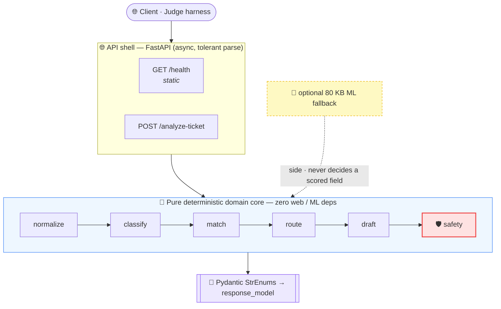
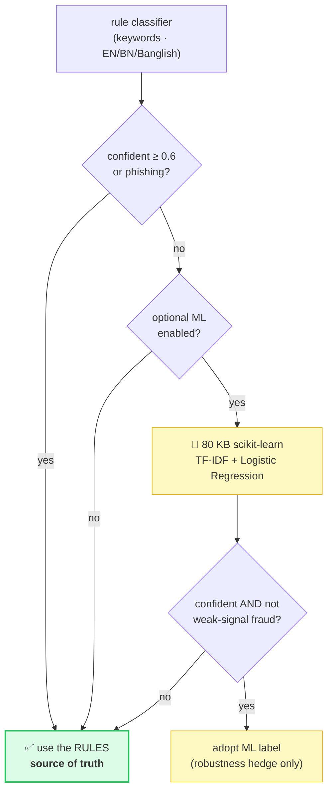
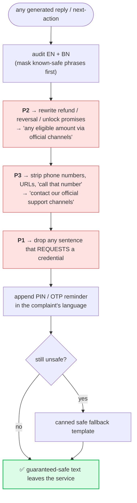

<!--
  QueueStorm Investigator — 4-slide presentation deck (Team Aquila).
  HOW TO PRESENT:
    • GitHub: push and open this file — Mermaid renders natively. Each "---" is a slide.
    • VS Code: install "Markdown Preview Mermaid Support", open preview (Ctrl/Cmd+Shift+V), full-screen it.
    • Scroll one slide per screen while recording. Diagrams are trimmed to fit a 16:9 frame.
  Covers the four required topics: architecture · API flow · AI/model usage · safety logic.
-->

# 🛰️ QueueStorm Investigator
### Team Aquila · An evidence-grounded support copilot for digital finance

> Reads **one complaint + recent transactions** → returns **one structured JSON verdict**.
> Not a complaint *classifier* — a complaint **investigator**: the complaint says one thing, the data
> may say another, and the service decides **what is actually true**.

4 slides · Architecture → API Flow → AI/Model Usage → Safety

---

## 1️⃣ Solution Architecture — a *rules-first hybrid*

**📌 What this shows**
- A thin **async FastAPI** edge wraps a **pure, deterministic domain core** — the core imports *nothing*
  from the web or ML layers, so it’s fast, reproducible, and unit-testable in isolation.
- The **rule engine is the single source of truth** for all **six auto-scored fields**.
- **Pydantic `StrEnum`s** make emitting an invalid enum *impossible* — free schema correctness.
- The ML model sits **on the side**: an optional assist that can never decide a scored field.
  **$0, fully offline, no quota risk.**

Team Aquila · QueueStorm Investigator · 1 / 4

---

## 2️⃣ API Flow — the 8-stage investigation pipeline

```mermaid
flowchart LR
    IN([complaint + transactions]) --> P1["parse +<br/>normalize"]
    P1 --> P2["classify case_type<br/><b>from the complaint</b>"]
    P2 --> P3["match<br/>transaction"]
    P3 --> P4["judge evidence_verdict<br/><b>from the data</b>"]
    P4 --> P5["route dept ·<br/>severity ·<br/>human review"]
    P5 --> P6["draft<br/>text"]
    P6 --> P7[/"🛡️ safety filter<br/>(runs last)"/]
    P7 --> OUT([✅ structured JSON verdict])

    style P2 fill:#eef7ff,stroke:#3b82f6
    style P4 fill:#eef7ff,stroke:#3b82f6
    style P7 fill:#fee2e2,stroke:#ef4444,stroke-width:2px
    style OUT fill:#dcfce7,stroke:#22c55e
```

**📌 What this shows**
- Two endpoints only: a **static `/health`** (ready in well under 60 s) and **`POST /analyze-ticket`**,
  which runs this **deterministic 8-stage pipeline** in **~1–5 ms** (p95 ≈ 20 ms, no network).
- `case_type` is decided **from the complaint**; `evidence_verdict` is decided **from the transaction
  data** — two **independent axes**.
- When the evidence is genuinely ambiguous, it returns **`null` + `insufficient_data`** and asks for
  clarification — **honest uncertainty instead of a confident guess**.
- The service **never crashes**: bad input → controlled `400 / 422`, internal error → generic `500`,
  `ticket_id` always echoed.

Team Aquila · QueueStorm Investigator · 2 / 4

---

## 3️⃣ AI / Model Usage — rules decide, the model only assists

**📌 What this shows**
- **No LLM in the judged path.** Every scored field and every safety guarantee is pure code.
- A tiny **80 KB local classifier** (in-process, CPU, sub-millisecond, **no network**) is consulted
  **only** when the rules are *unsure* — a hedge for unusual phrasings.
- **Guard-railed:** it can **never override a phishing/safety label** and **never decides a scored
  field** — at most it nudges the *prose*.
- Result: an ML or LLM outage **degrades quality, never availability** — and the cost is **$0**.

Team Aquila · QueueStorm Investigator · 3 / 4

---

## 4️⃣ Safety Logic — a deterministic filter on the wire

**📌 What this shows**
- A **code-level filter runs LAST** on every `customer_reply` and `recommended_next_action` — even a
  jailbroken model **cannot put an unsafe string on the wire**.
- **P1** never asks for PIN/OTP/password/card *(−15)* · **P2** never promises a refund/reversal/unlock
  *(−10)* · **P3** never directs to a suspicious third party *(−10)*.
- The **credential-safety reminder** is appended **programmatically in the complaint’s language**, so
  it can never be dropped.
- Prompt-injection in the complaint is treated as **untrusted data, never instructions**.

> ✅ **Proof:** 10 / 10 public sample cases match · **92 automated tests pass** · deployed & live.

Team Aquila · QueueStorm Investigator · 4 / 4
