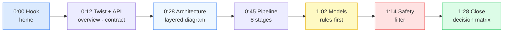

# 🎬 90-Second Architecture Video — Recording Script

[🏠 Docs Home](README.md)

> **Team Aquila** · QueueStorm Investigator. A copy-paste storyboard for the optional 90-second
> architecture overview video. It maps **every line you say** to **the exact doc page and diagram to
> have on screen** — so you can record in one take by scrolling through these docs.

The submission asks the video to cover four things. This script hits all four, in order:

| The judges want… | Covered in segment |
|------------------|--------------------|
| **Solution architecture** | ② Architecture |
| **API flow** | ①+③ Twist & endpoints + Pipeline |
| **AI / model usage (if any)** | ④ Models |
| **Safety logic** | ⑤ Safety |

---

## 🛠️ Before you hit record (2 minutes of setup)

The diagrams are **Mermaid**. Pick whichever renders them for you:

| Option | How | Why |
|--------|-----|-----|
| **GitHub (recommended)** | Push the repo, open `docs/README.md` in the browser. GitHub renders Mermaid natively. | Cleanest diagrams, zero local setup, looks polished on camera. |
| **VS Code preview** | Install *Markdown Preview Mermaid Support*, open a doc, `Ctrl/Cmd-Shift-V`. | Works offline; you're already here. |

**Recording hygiene**
- Full-screen the browser/preview at **1920×1080**; hide the bookmarks bar and any notifications.
- Zoom the page to ~110–125 % so diagram text is legible after compression.
- Open these **9 tabs in order** so you can just `Ctrl-Tab` through them (no fumbling for links):
  1. `docs/README.md`  2. `docs/01-overview`  3. `docs/03-api-contract`  4. `docs/02-architecture`
  5. `docs/04-investigation-pipeline`  6. `docs/07-evidence-matching`  7. `docs/04…#ml-fallback` (or README **MODELS**)
  8. `docs/09-safety-system`  9. `docs/14-decision-matrix`
- Aim for ~**150 words/min** (calm, clear). The full script below is **~225 words ≈ 90 s**.
- Record one practice pass muted just to rehearse the scrolling.

---

## 🎞️ The storyboard (90 seconds)

Each row = one beat. **Show** tells you what to have on screen; **Say** is the exact narration.

### ① 0:00 – 0:12 · Hook — *what it is*
- **Show:** [`docs/README.md`](README.md) → scroll to **“The big picture (one diagram)”** flowchart.
- **Say:**
  > “This is **QueueStorm Investigator** by Team Aquila — a support copilot for digital finance. It
  > reads **one complaint plus recent transactions** and returns **one structured JSON verdict**. The
  > twist: it’s not a classifier, it’s an **investigator**.”

### ② 0:12 – 0:28 · The investigator twist + the API
- **Show:** [`docs/01-overview`](01-overview/README.md) → the **“Investigator Twist”** diagram
  (complaint vs. history → `inconsistent`). Then flick to
  [`docs/03-api-contract`](03-api-contract/README.md) endpoints table.
- **Say:**
  > “The complaint says one thing; the transaction data may say another — and the service decides
  > **what’s actually true**. Two endpoints: a static **`/health`**, and **`POST /analyze-ticket`**,
  > which returns the verdict — case type, severity, department, and a **safe customer reply** — in
  > milliseconds.”

### ③ 0:28 – 0:45 · Solution architecture
- **Show:** [`docs/02-architecture`](02-architecture/README.md) → the **layered container diagram**.
- **Say:**
  > “Architecturally it’s a **rules-first hybrid**. A thin async **FastAPI** shell wraps a **pure
  > deterministic domain core** with zero web or ML dependencies. The **rule engine is the single
  > source of truth** for all six auto-scored fields, and **Pydantic StrEnums** make an invalid enum
  > impossible to emit.”

### ④ 0:45 – 1:02 · API flow — the investigation pipeline
- **Show:** [`docs/04-investigation-pipeline`](04-investigation-pipeline/README.md) → the **8-stage
  activity diagram**. Optionally flick to the [evidence decision tree](07-evidence-matching/README.md)
  on the word “ambiguous”.
- **Say:**
  > “Every request runs an **eight-stage pipeline**: normalize, classify the case type **from the
  > complaint**, match the transaction, judge the evidence verdict **from the data**, route the
  > department, set severity and human-review, then draft text. When evidence is **ambiguous**, it
  > honestly returns **`null` + insufficient-data** instead of guessing.”

### ⑤ 1:02 – 1:14 · AI / model usage
- **Show:** [`docs/04…#ml-fallback`](04-investigation-pipeline/README.md#-how-the-ml-fallback-is-gated-stage-)
  ML-gating diagram, or the **MODELS** table in [`README.md`](../README.md).
- **Say:**
  > “On models: the **judged path needs no LLM**. An optional **80-kilobyte scikit-learn** classifier
  > is a local fallback for unusual phrasings only — it can **never decide a scored field**. Zero
  > cost, fully offline, no quota risk.”

### ⑥ 1:14 – 1:28 · Safety logic
- **Show:** [`docs/09-safety-system`](09-safety-system/README.md) → the **filter pipeline activity
  diagram** (P1/P2/P3).
- **Say:**
  > “**Safety is a deterministic filter that runs last** on every reply — it rewrites refund promises,
  > strips credential requests and suspicious numbers, and always appends a **PIN-and-OTP warning in
  > the complaint’s language**. Even a jailbroken model can’t put an unsafe string on the wire.”

### ⑦ 1:28 – 1:30 · Close — the proof
- **Show:** [`docs/14-decision-matrix`](14-decision-matrix/README.md) → the **10-case matrix**.
- **Say:**
  > “**Ten of ten** samples, **ninety-two tests**, deployed and live.”

---

## ⏱️ Tight 60-second cut (if you must trim)

Drop the close to a freeze-frame and compress segments ② and ④:

1. **(0:00–0:10)** Hook — “QueueStorm Investigator: reads a complaint + transactions, returns one JSON
   verdict. Not a classifier — an investigator.” → *home diagram*
2. **(0:10–0:25)** Architecture — “Rules-first hybrid: FastAPI shell, pure deterministic core; the
   rule engine decides all six scored fields; StrEnums guarantee the schema.” → *architecture diagram*
3. **(0:25–0:42)** Pipeline — “Eight stages: classify from the complaint, judge evidence from the
   data; ambiguous ⇒ honest `null`.” → *pipeline diagram*
4. **(0:42–0:52)** Models — “No LLM in the scored path; an optional 80 KB sklearn fallback that never
   decides a field. $0, offline.” → *MODELS table*
5. **(0:52–1:00)** Safety — “A deterministic filter runs last: no refund promises, no credential
   requests, always a PIN/OTP warning in the right language.” → *safety diagram*

---

## ✅ Pre-upload checklist

- [ ] Video is **≤ 90 s**, 1080p, audio clear, diagrams legible.
- [ ] All four required topics shown: **architecture · API flow · AI/model usage · safety logic**.
- [ ] No secrets / API keys / `.env` values visible on screen at any point.
- [ ] Uploaded to Drive / YouTube / Dropbox **with link sharing ON** (anyone-with-link can view — no
      access request).
- [ ] Link pasted into the submission form **and** opened in a private/incognito window to confirm it
      plays without login.

---

[🏠 Docs Home](README.md)
