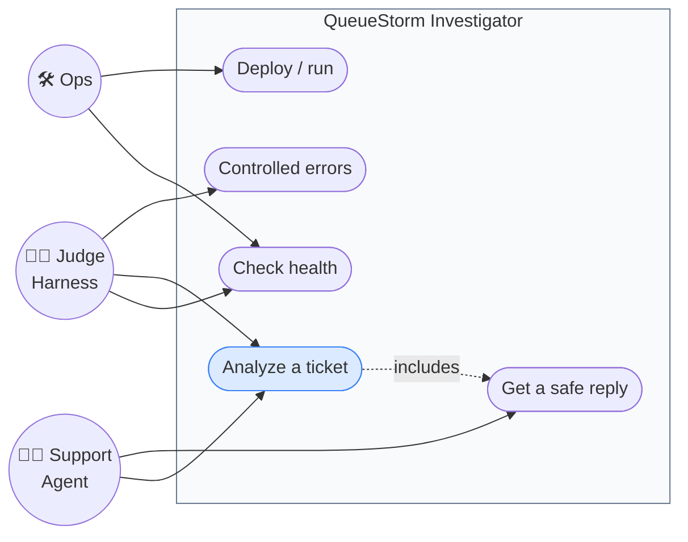
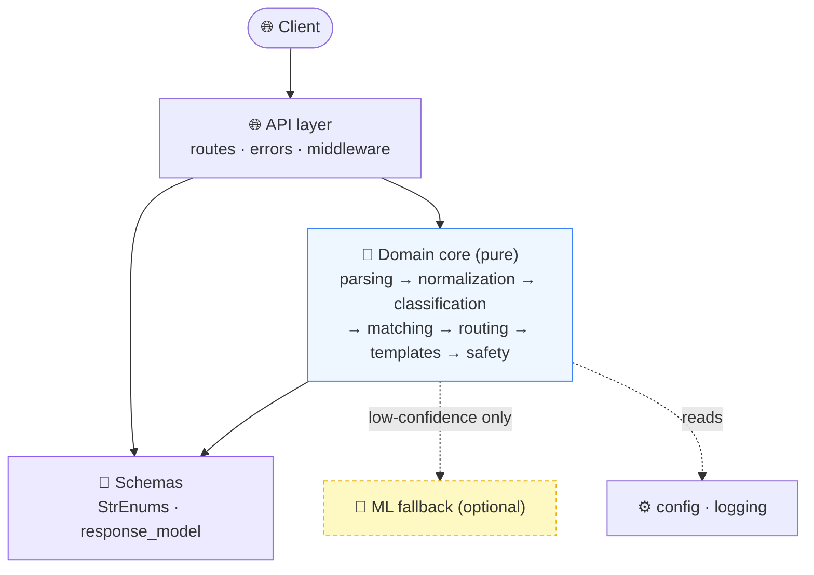
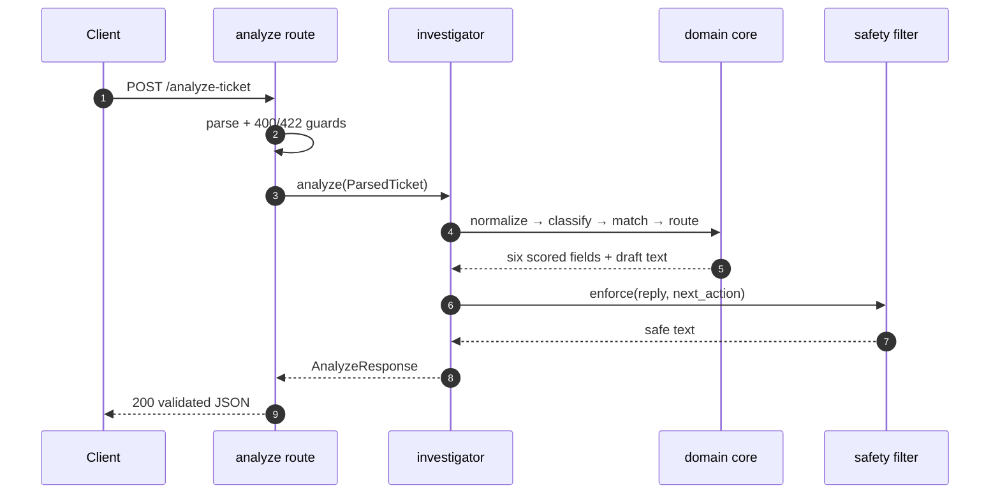
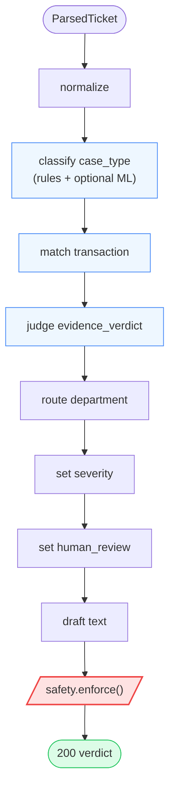
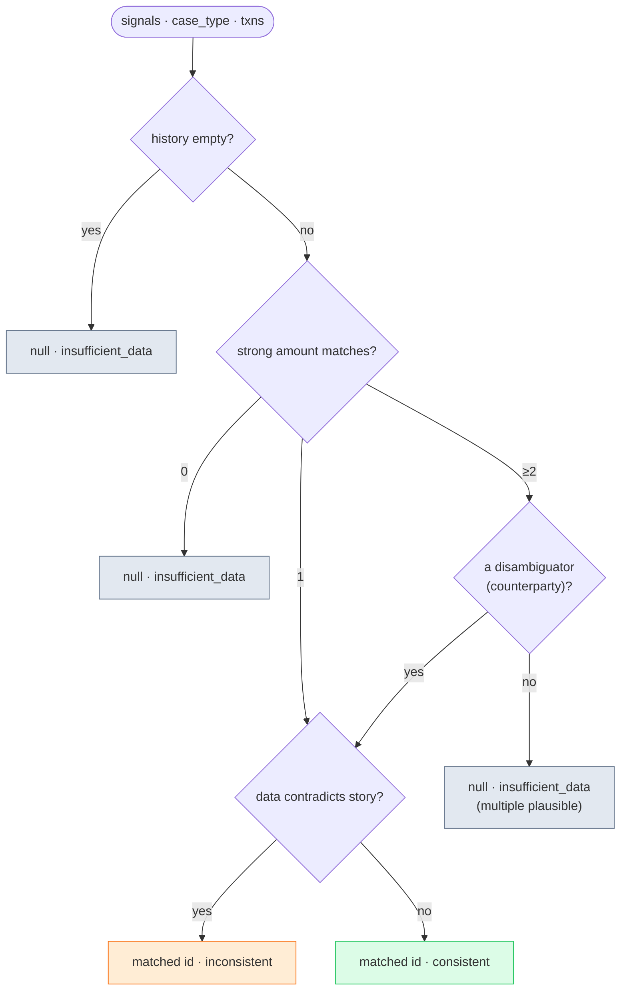
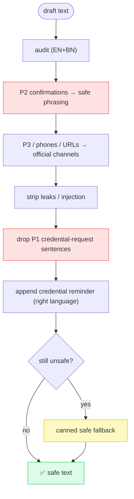

# 📐 System Diagrams — Quick Reference

[🏠 Docs Home](../README.md)

A one-stop collection of the headline diagrams for presentations and quick onboarding. Each diagram
links to the chapter where it is explained in depth. All diagrams are **Mermaid** and render natively
on GitHub.

| Type | Diagram | Explained in |
|------|---------|--------------|
| 🎭 Use case | Actors & capabilities | [01 · Overview](../01-overview/README.md) |
| 🧱 Component | Layered architecture | [02 · Architecture](../02-architecture/README.md) |
| 🔁 Sequence | Request lifecycle | [02](../02-architecture/README.md) · [04](../04-investigation-pipeline/README.md) |
| 🏃 Activity | Investigation pipeline | [04 · Pipeline](../04-investigation-pipeline/README.md) |
| 🏃 Activity | Evidence decision tree | [07 · Evidence](../07-evidence-matching/README.md) |
| 🏃 Activity | Safety filter | [09 · Safety](../09-safety-system/README.md) |

---

## 🎭 Use case — who uses the system

---

## 🧱 Component — layered architecture

---

## 🔁 Sequence — request lifecycle

---

## 🏃 Activity — the investigation pipeline

---

## 🏃 Activity — evidence decision (the investigator's brain)

---

## 🏃 Activity — the safety filter

---

[🏠 Docs Home](../README.md)
